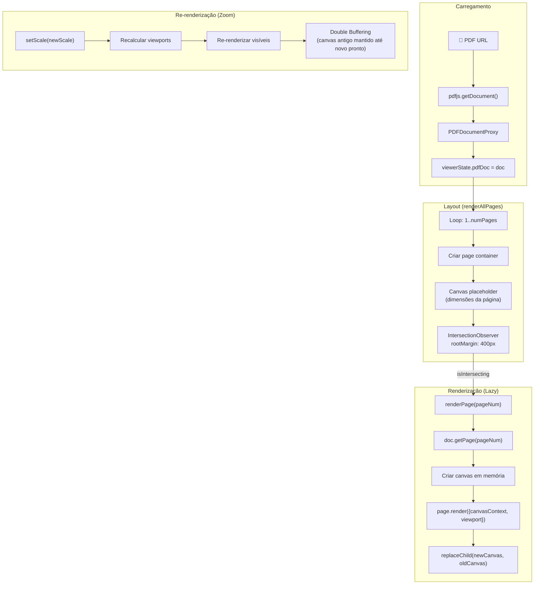
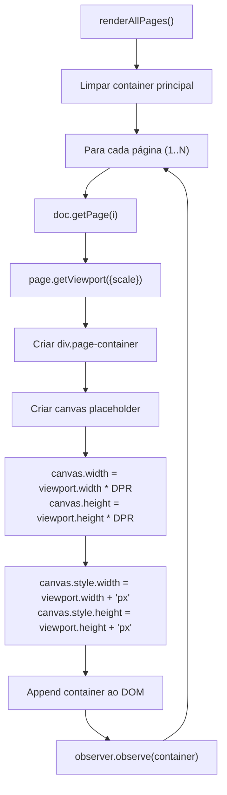
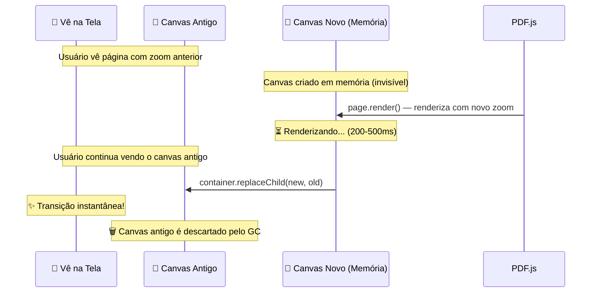
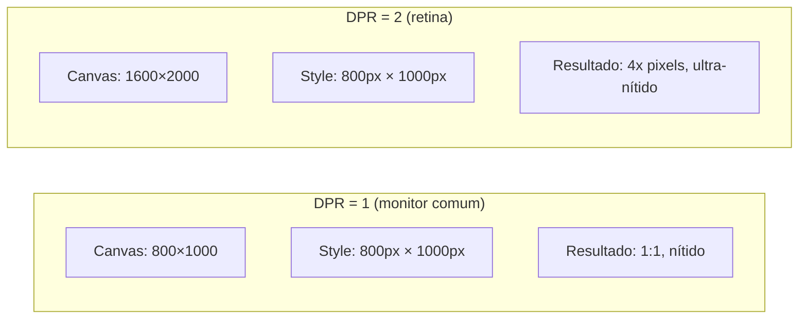
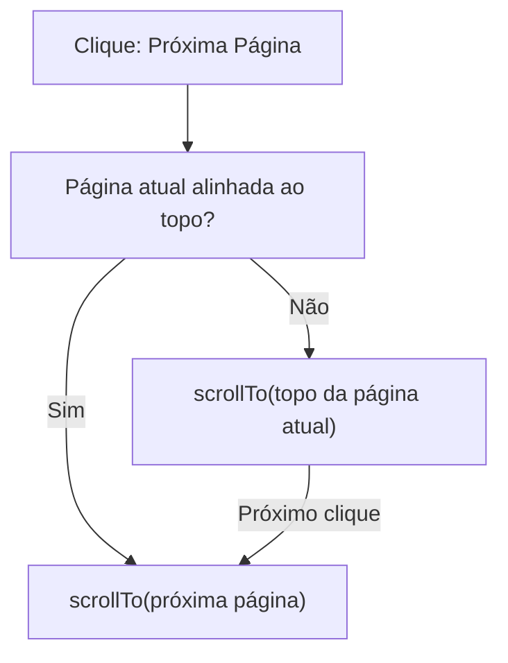

# Renderização Core — pdf-core.js

## Arquivo-Fonte

| Propriedade | Valor |
|------------|-------|
| **Arquivo** | [`js/viewer/pdf-core.js`](file:///c:/Users/jcamp/Downloads/maia.api/js/viewer/pdf-core.js) |
| **Linhas** | ~800 |
| **Tamanho** | 20.7 KB |
| **Exports** | `carregarDocumentoPDF()`, `renderAllPages()`, `renderPageHighRes()`, `goToPage()`, `setScale()` |
| **Dependências** | `pdfjs-dist`, `viewerState` (main.js), `events.js`, `resizer.js` |

---

## Visão Geral

O `pdf-core.js` é o **coração do visualizador de PDF**. Ele gerencia todo o ciclo de vida da renderização: desde o carregamento do documento até a renderização individual de cada página com lazy loading, double buffering e suporte a zoom.

---

## Arquitetura de Renderização



---

## Função: `carregarDocumentoPDF(url)`

Carrega um documento PDF a partir de uma URL e armazena a referência no estado global.

```javascript
export async function carregarDocumentoPDF(url) {
  // 1. Configurar worker do PDF.js
  pdfjsLib.GlobalWorkerOptions.workerSrc = PDF_WORKER_CDN_URL;
  
  // 2. Carregar documento
  const loadingTask = pdfjsLib.getDocument({
    url: url,
    cMapUrl: CMAP_URL,
    cMapPacked: true,
  });
  
  // 3. Armazenar no estado global
  viewerState.pdfDoc = await loadingTask.promise;
  
  // 4. Iniciar renderização
  renderAllPages();
}
```

### Parâmetros de Carregamento

| Parâmetro | Valor | Propósito |
|-----------|-------|----------|
| `url` | URL do PDF | Pode ser local ou via `/proxy-pdf` |
| `cMapUrl` | CDN | Character maps para PDFs com fontes especiais |
| `cMapPacked` | `true` | CMaps compactados para download mais rápido |

---

## Função: `renderAllPages()`

Cria o layout completo do documento com containers para cada página, configurando lazy loading via IntersectionObserver.

### Fluxo Detalhado



### IntersectionObserver Configuration

```javascript
const observer = new IntersectionObserver(
  (entries) => {
    entries.forEach((entry) => {
      if (entry.isIntersecting) {
        const pageNum = parseInt(entry.target.dataset.pageNum);
        renderPage(pageNum);
        observer.unobserve(entry.target); // Renderiza apenas uma vez
      }
    });
  },
  {
    rootMargin: '400px 0px', // Pré-carrega 400px antes de ser visível
    threshold: 0.01,         // 1% visível é suficiente
  }
);
```

**Por que `rootMargin: 400px`?**
- Permite que a próxima página comece a renderizar antes de ser visível
- Em scroll rápido, o usuário raramente vê um placeholder vazio
- 400px foi calibrado para equilibrar performance e UX

**Por que `unobserve` após renderização?**
- Evita re-renderizações desnecessárias ao scrollar
- Re-renderização só ocorre via `setScale()` (zoom)

---

## Função: `renderPage(pageNum)`

Renderiza uma página individual usando **double buffering**:

```javascript
async function renderPage(pageNum) {
  const page = await viewerState.pdfDoc.getPage(pageNum);
  const viewport = page.getViewport({ scale: viewerState.pdfScale });
  
  // 1. Criar canvas em memória (não no DOM ainda)
  const canvas = document.createElement('canvas');
  const ctx = canvas.getContext('2d');
  
  // 2. Dimensões com DPR para retina
  const dpr = window.devicePixelRatio || 1;
  canvas.width = Math.floor(viewport.width * dpr);
  canvas.height = Math.floor(viewport.height * dpr);
  canvas.style.width = viewport.width + 'px';
  canvas.style.height = viewport.height + 'px';
  ctx.scale(dpr, dpr);
  
  // 3. Renderizar em memória
  await page.render({
    canvasContext: ctx,
    viewport: viewport,
  }).promise;
  
  // 4. Swap atômico (double buffering)
  const container = document.querySelector(`[data-page-num="${pageNum}"]`);
  const oldCanvas = container.querySelector('canvas');
  container.replaceChild(canvas, oldCanvas);
}
```

### Double Buffering Visual



---

## DPR (Device Pixel Ratio) Handling

O DPR é critical para renderização nítida em telas retina:



| Monitor | DPR | Canvas Pixels | CSS Pixels | Qualidade |
|---------|-----|--------------|-----------|-----------|
| 1080p | 1 | 800×1000 | 800×1000 | Normal |
| Retina Mac | 2 | 1600×2000 | 800×1000 | Alta |
| iPhone 14 | 3 | 2400×3000 | 800×1000 | Ultra |

---

## Page Dominance Algorithm

O algoritmo de "page dominance" determina qual página está mais visível na viewport:

```javascript
function getPageDominante() {
  const container = document.getElementById('viewer-container');
  const containerRect = container.getBoundingClientRect();
  
  let maxVisibleHeight = 0;
  let dominantPage = 1;
  
  document.querySelectorAll('.page-container').forEach((page) => {
    const rect = page.getBoundingClientRect();
    
    // Calcular altura visível
    const top = Math.max(rect.top, containerRect.top);
    const bottom = Math.min(rect.bottom, containerRect.bottom);
    const visibleHeight = Math.max(0, bottom - top);
    
    if (visibleHeight > maxVisibleHeight) {
      maxVisibleHeight = visibleHeight;
      dominantPage = parseInt(page.dataset.pageNum);
    }
  });
  
  return dominantPage;
}
```

---

## Função: `renderPageHighRes(pageNum)` 

Renderiza uma página em **alta resolução** (300 DPI) para o AI Scanner:

```javascript
export async function renderPageHighRes(pageNum) {
  const page = await viewerState.pdfDoc.getPage(pageNum);
  
  // Escala para 300 DPI (vs 72 DPI padrão)
  const dpiScale = 300 / 72; // ≈ 4.17x
  const viewport = page.getViewport({ scale: dpiScale });
  
  const canvas = document.createElement('canvas');
  const ctx = canvas.getContext('2d');
  canvas.width = viewport.width;
  canvas.height = viewport.height;
  
  await page.render({
    canvasContext: ctx,
    viewport: viewport,
  }).promise;
  
  // Retorna como base64 para enviar ao Gemini
  return canvas.toDataURL('image/jpeg', 0.85);
}
```

| Resolução | DPI | Scale | Tamanho Típico (A4) | Uso |
|-----------|-----|-------|---------------------|-----|
| Viewer normal | 72 | 1.0 | 595×842 px | Visualização no browser |
| High-res (scanner) | 300 | 4.17 | 2480×3508 px | Envio ao Gemini para OCR |

---

## Smart Align

O sistema de navegação implementa "smart align" — ao clicar em "próxima página", se a página atual não está alinhada ao topo, primeiro alinha antes de navegar:



---

## Estado Global (viewerState)

O módulo depende do estado global exportado por `main.js`:

```javascript
export const viewerState = {
  pdfDoc: null,       // PDFDocumentProxy (pdfjs-dist)
  pageNum: 1,         // Página dominante atual
  pdfScale: 1.0,      // Nível de zoom atual
  totalPages: 0,      // Total de páginas do documento
};
```

---

## Referências Cruzadas

| Tópico | Link |
|--------|------|
| Eventos do Viewer | [Sistema de Eventos (events.js)](/pdf/eventos) |
| Zoom e Escala | [Zoom e Escala (resizer.js)](/pdf/zoom) |
| Sidebar Desktop | [Sidebar Desktop](/pdf/sidebar-desktop) |
| AI Scanner (usa renderPageHighRes) | [AI Scanner Pipeline](/ocr/scanner-pipeline) |
| Cropper (interage com pages) | [Cropper Core](/cropper/core) |
