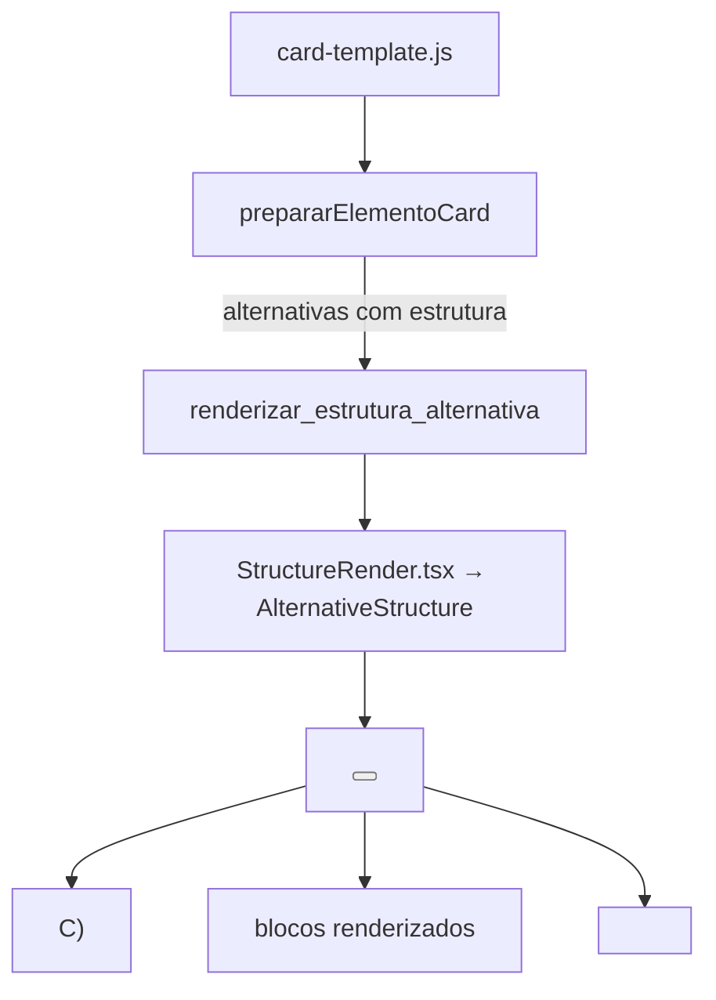

# Alternativas Render — Renderização de Opções de Resposta

> 🤖 **Disclaimer**: Documentação gerada por IA e pode conter imprecisões. [📋 Reportar erro](https://github.com/TouchRefletz/maia.api/issues/new?title=Erro+na+doc:+alternativas&labels=docs)

## Visão Geral

O módulo `AlternativasRender.tsx` (`js/render/AlternativasRender.tsx`) é um componente React especializado na renderização do painel de alternativas de múltipla escolha dentro de questões de vestibular. Com 3.797 bytes, ele lida com a complexidade de alternativas que contêm não apenas texto, mas estruturas compostas: equações LaTeX, imagens, citações, e tabelas misturados dentro de cada opção A-E.

## Diferença da Renderização Simples

Na forma mais simples, alternativas são texto puro: `A) 42`. Mas no maia.edu, uma alternativa pode conter:

```json
{
  "letra": "C",
  "estrutura": [
    { "tipo": "texto", "conteudo": "A aceleração é dada por:" },
    { "tipo": "equacao", "conteudo": "a = \\frac{\\Delta v}{\\Delta t}" },
    { "tipo": "texto", "conteudo": "onde $\\Delta v = v_f - v_i$" }
  ]
}
```

O `AlternativasRender` precisa renderizar cada bloco interno usando os mesmos componentes de bloco do [StructureRender](/render/render-components), mas num contexto compacto (dentro de um botão clicável).

## Arquitetura do Componente



## Renderização de Alternativas Complexas

### Com Estrutura

Quando a alternativa possui `estrutura` (array de blocos), cada bloco é renderizado sequencialmente:

```typescript
export const AlternativeContent: React.FC<Props> = ({ estrutura, letra, imgsExternas }) => {
  return (
    <>
      {estrutura.map((bloco, i) => {
        const { tipo, conteudo } = normalizarBloco(bloco);
        switch (tipo) {
          case "texto":
            return <span key={i} className="markdown-content" data-raw={escape(conteudo)}>{conteudo}</span>;
          case "equacao":
            return <span key={i} className="math-inline">{`$${conteudo}$`}</span>;
          case "imagem":
            return ;
          default:
            return <span key={i}>{conteudo}</span>;
        }
      })}
    </>
  );
};
```

### Sem Estrutura (Legado)

Para alternativas no formato antigo (`{ letra: "A", texto: "42" }`), o conteúdo é renderizado como texto puro:

```typescript
if (!alt.estrutura) {
  return <span>{alt.texto || ""}</span>;
}
```

## Estados Visuais da Alternativa

Cada alternativa passa por estados visuais controlados por CSS classes:

| Estado | Classe CSS | Visual |
|--------|-----------|--------|
| Neutro | `q-opt-btn` | Background transparente, borda sutil |
| Hover | `q-opt-btn:hover` | Background levemente iluminado |
| Correto | `q-opt-correct` | Background verde suave, ícone ✅ |
| Incorreto | `q-opt-wrong` | Background vermelho suave, ícone ❌ |
| Desabilitado | `q-opt-btn:disabled` | Opacity 0.7, cursor default |

Após o aluno clicar, TODAS as alternativas recebem `disabled = true` (impedir múltiplas tentativas) e a alternativa correta recebe `q-opt-correct` independente de qual foi clicada.

## Escape de Motivos (Anti-XSS)

Os motivos de cada alternativa (por que correta/incorreta) são armazenados em `data-motivo` no HTML. Como esse conteúdo vem da IA, é escapado contra XSS:

```javascript
const motivoEscapado = motivoRaw
  .replace(/"/g, "&quot;")
  .replace(/</g, "&lt;")
  .replace(/>/g, "&gt;");
```

## O Wrapper em `alternativas.js`

O arquivo `js/render/alternativas.js` (715 bytes) é um thin wrapper de exportação que re-exporta funções do componente TSX para consumo por módulos JS legados:

```javascript
export { renderizar_estrutura_alternativa } from "./structure.js";
```

Esta camada de indireção existe por razões históricas — o módulo legado importava de `alternativas.js`, e removê-lo quebraria dependências transitivas.

## Referências Cruzadas

- [Card Template — Gera o HTML dos botões de alternativa](/banco/card-template)
- [Interações — Lógica de clique e feedback visual](/banco/interacoes)
- [Structure Render — Componentes de bloco reutilizados](/render/structure)
- [StructureRender.tsx — Implementação React](/render/render-components)
