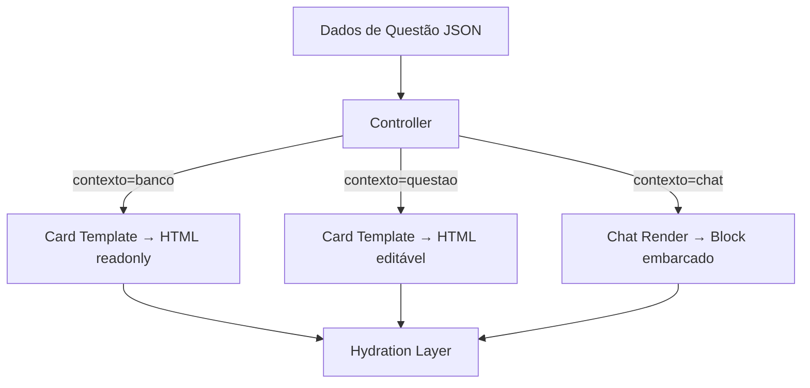
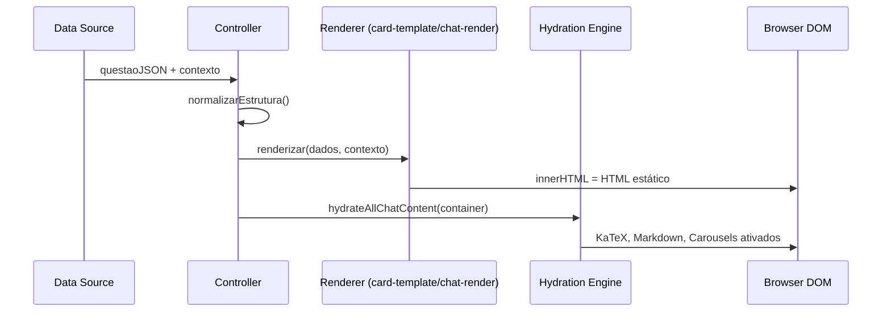

# Controller — Orquestrador de Renderização

> 🤖 **Disclaimer**: Documentação gerada por IA e pode conter imprecisões. [📋 Reportar erro](https://github.com/TouchRefletz/maia.api/issues/new?title=Erro+na+doc:+controller&labels=docs)

## Visão Geral

O módulo **Controller** (`js/render/`) é a camada de coordenação que decide **quando** e **como** renderizar o conteúdo de questões no maia.edu. Ele atua como um dispatcher que roteia dados de questões para os renderers corretos baseado no contexto de uso: Banco de Questões (cards readonly), editor de upload (cards editáveis), ou chat (cards embarcados em mensagens).

## Responsabilidades

O Controller NÃO renderiza conteúdo diretamente — ele:
1. Recebe dados brutos de questões (JSON)
2. Normaliza e valida a estrutura
3. Determina o contexto de renderização
4. Delega para o renderer apropriado
5. Gerencia o lifecycle dos componentes



## Determinação de Contexto

O parâmetro `contexto` é propagado por toda a cadeia de renderização e afeta:

| Contexto | Botões de edição | Cropper de imagem | Review buttons | LaTeX rendering |
|----------|-----------------|-------------------|----------------|----------------|
| `"banco"` | ❌ Ocultos | ❌ Desativado | ❌ Ocultos | ✅ Ativo |
| `"questao"` | ✅ Visíveis | ✅ Ativo | ✅ Visíveis | ✅ Ativo |
| `"chat"` | ❌ Ocultos | ❌ Desativado | ❌ Ocultos | ✅ Ativo |

## Normalização de Entrada

Antes de delegar, o Controller normaliza os dados usando `normalizarEstrutura()` de `structure.js`:

```javascript
import { normalizarEstrutura } from "./structure.js";

function prepararParaRender(questaoData) {
  // Normaliza array de blocos
  const estruturaNormalizada = normalizarEstrutura(questaoData.estrutura);

  // Garante que tipos desconhecidos foram degradados para "imagem"
  // Garante que conteúdo é sempre string
  return { ...questaoData, estrutura: estruturaNormalizada };
}
```

## Ciclo de Vida dos Componentes



O ponto crítico é a separação entre renderização (síncrona, < 5ms) e hidratação (assíncrona, < 50ms). O Controller garante que a hidratação só roda DEPOIS que o HTML estático está no DOM.

## Integração com React

Componentes React são usados internamente via `ReactDOMServer.renderToStaticMarkup()` para gerar HTML server-side, mas os React roots para componentes interativos (como `ComplexityCard`) são criados na fase de hydration, não na fase de render.

## Error Boundaries

O Controller envolve toda renderização em try/catch:

```javascript
try {
  const card = criarCardTecnico(id, fullData);
  container.appendChild(card);
} catch (err) {
  console.error("Render error:", err);
  container.innerHTML = `<div class="render-error">Erro ao renderizar questão</div>`;
}
```

Se qualquer sub-renderer falhar (LaTeX inválido, imagem corrompida, JSON malformado), o card inteiro é substituído por mensagem de erro — evitando que uma questão quebrada contamine o layout.

## Referências Cruzadas

- [Structure Render — Renderiza blocos individuais](/render/structure)
- [Card Template — Renderiza cards completos para Banco](/banco/card-template)
- [Hydration — Ativa componentes pós-render](/render/hydration)
- [ComplexityCard — Componente React renderizado via hydration](/render/complexidade)
