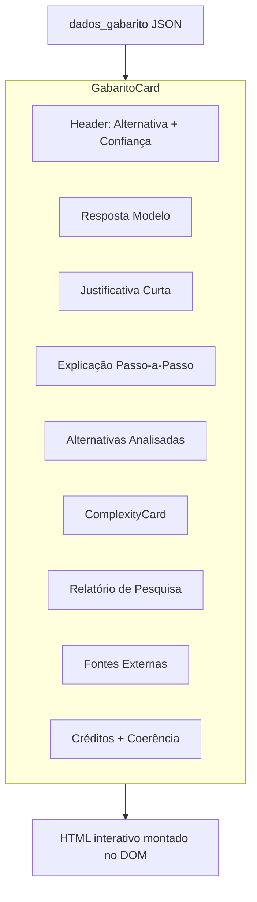

# GabaritoCard — Renderização de Resolução de Questões

> 🤖 **Disclaimer**: Documentação gerada por IA e pode conter imprecisões. [📋 Reportar erro](https://github.com/TouchRefletz/maia.api/issues/new?title=Erro+na+doc:+gabarito&labels=docs)

## Visão Geral

O `GabaritoCard.tsx` (`js/render/GabaritoCard.tsx`) é o **maior componente React individual** do maia.edu com 81.544 bytes de código. Ele renderiza a interface completa de resolução/gabarito de questões de vestibular — desde a alternativa correta e justificativa até a resolução passo-a-passo, matriz de complexidade, relatório de pesquisa, análise de alternativas, e créditos editoriais.

É usado tanto no editor de upload (onde administradores criam/editam gabaritos) quanto no Banco de Questões (onde alunos visualizam resoluções).

## Escopo Funcional



## O Problema do Tamanho

Com 81KB, o `GabaritoCard.tsx` é criticamamente grande. Isso se justifica pela complexidade do domínio:
- Gabaritos possuem 10+ seções distintas (cada uma com lógica de renderização própria)
- Suporte dual: modo readonly (banco) e modo editável (upload)
- Renderização condicional: cada seção pode estar presente ou ausente
- Dados heterogêneos: alternativas, passos, pesquisas, fontes, complexidade

### Estrutura Interna

O componente é dividido em sub-renderers internos:

1. **HeaderSection**: Badge da alternativa correta + score de confiança em porcentagem
2. **RespostaModeloSection**: Para dissertativas, exibe a resposta esperada com Markdown
3. **JustificativaSection**: Texto curto explicando o porquê da resposta correta
4. **PassosSection**: Lista colapsável de passos da resolução, cada um com:
   - Título opcional
   - Array de blocos estruturados (texto, equações, imagens)
   - Badge de origem (IA vs. material original)
   - Fonte/evidência
5. **AlternativasAnalisadasSection**: Grid com cada alternativa e seu motivo
6. **ComplexitySection**: Monta o [ComplexityCard](/render/complexidade) com os 14 fatores
7. **PesquisaSection**: Se gerado via [Deep Search](/infra/deep-search), mostra fontes consultadas
8. **FontesExternasSection**: Links clicáveis para referências
9. **CreditsSection**: Autor, instituição, ano, origem da resolução
10. **CoerenciaSection**: Alertas de consistência (gabarito de outra questão, etc.)

## Renderização de Passos

A seção mais complexa. Cada passo é um `<details>` colapsável:

```tsx
{gabarito.explicacao?.map((passo, i) => (
  <details key={i} className="q-step">
    <summary>
      <span className="step-number">Passo {i + 1}</span>
      {passo.estrutura?.[0]?.tipo === "titulo" && (
        <span className="step-title">{passo.estrutura[0].conteudo}</span>
      )}
      <span className={`step-origin ${passo.origem}`}>
        {passo.origem === "gerado_pela_ia" ? "🤖 IA" : "📄 Material"}
      </span>
    </summary>
    <div className="step-content">
      {passo.estrutura?.map((bloco, j) => renderBloco(bloco, j))}
    </div>
  </details>
))}
```

### Badges de Origem por Passo

Cada passo indica se foi extraído do material original ou gerado pela IA:

| Origem | Badge | Significado |
|--------|-------|-------------|
| `extraido_do_material` | 📄 Material | Passo veio do PDF scanneado |
| `gerado_pela_ia` | 🤖 IA | Passo foi criado pelo Gemini |

Isso permite que o aluno saiba a proveniência de cada parte da resolução.

## Modo Editável vs. Readonly

No modo editável (editor de upload), cada seção possui:
- Botões de edição inline
- Campos de texto editáveis para correção manual
- Botão "Regenerar com IA" para re-processar seções específicas
- Drag-and-drop para reordenar passos

No modo readonly (banco), toda a interface de edição é ocultada e o conteúdo é estático.

## Sanitização de Markdown

Campos de texto longo (justificativa, resposta modelo) contêm Markdown cru. A renderização armazena o raw em `data-raw` e a [hydration](/render/hydration) converte para HTML formatado, incluindo LaTeX via KaTeX.

## Referências Cruzadas

- [Card Template — Invoca o GabaritoCard no banco](/banco/card-template)
- [ComplexityCard — Sub-componente de dificuldade](/render/complexidade)
- [Config IA — Schema que define a estrutura do gabarito](/embeddings/config-ia)
- [Card Partes — Versão legacy JS das mesmas seções](/banco/card-partes)
