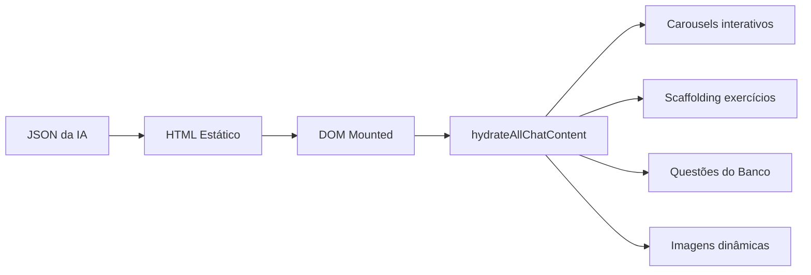

# Hydration — Motor de Hidratação Pós-Render

> 🤖 **Disclaimer**: Documentação gerada por IA e pode conter imprecisões. [📋 Reportar erro](https://github.com/TouchRefletz/maia.api/issues/new?title=Erro+na+doc:+render-hydration&labels=docs)

## Visão Geral

O `hydration.js` (`js/render/hydration.js`) é o **motor central de hidratação pós-renderização** do maia.edu. Depois que o HTML estático de uma mensagem de chat é montado no DOM, esta função `hydrateAllChatContent()` varre o container e ativa todos os componentes dinâmicos: carousels interativos, exercícios de scaffolding, questões embarcadas do banco, e imagens buscadas dinamicamente via IA.

Com 383 linhas de lógica assíncrona, é uma das funções mais complexas do projeto — orquestrando 4 subsistemas de hidratação em paralelo, cada um com seus próprios mecanismos de retry, fallback e persistência.

## O Conceito de Hidratação no maia.edu

No chat, a resposta da IA chega como JSON com blocos tipados. O pipeline de renderização converte esses blocos em HTML estático (rápido, sem JavaScript). Depois, a hidratação transforma placeholders estáticos em componentes vivos:



## Os 4 Subsistemas de Hidratação

### 1. Carousels (`hydrateCarousels`)

Transforma marcações estáticas de carousel em componentes deslizáveis com swipe e navegação por dots. Importa a lógica de `js/ui/carousel.js` e a aplica em todos os `.chat-carousel-placeholder` encontrados no container.

### 2. Scaffolding (`hydrateScaffoldingBlocks`)

Ativa exercícios interativos do modo Scaffolding Socrático. Blocos de scaffolding são placeholders que, quando hidratados, se tornam quizzes com input do aluno, feedback em tempo real, e progressão de nível.

```javascript
try {
  if (typeof hydrateScaffoldingBlocks === "function") {
    hydrateScaffoldingBlocks(container);
  }
} catch (e) {
  console.warn("Erro ao hidratar scaffolding:", e);
}
```

O try/catch é crucial: o scaffolding depende de estado global (`telas.js`), e se o contexto for um debugger isolado, a função pode não existir.

### 3. Questões do Banco (`hydrateQuestionBlocks`)

O subsistema mais sofisticado. Quando a IA recomenda uma questão no chat, ela gera um placeholder com filtros:

```html
<div class="chat-question-placeholder" data-filter='{"query":"integral definida","subject":"Matemática"}'>
  <div class="spinner">Buscando questão...</div>
</div>
```

A hidratação:
1. Parseia o `data-filter` JSON
2. Chama `findBestQuestion(filterData)` — busca vetorial no Pinecone + Firebase
3. Se encontra: gera um card completo via `criarCardTecnico()` e substitui o placeholder
4. Se não encontra: mostra mensagem "Questão não encontrada"
5. Renderiza LaTeX em todas as partes estáticas do card

```javascript
const q = await findBestQuestion(filterData);
if (q) {
  const card = criarCardTecnico(q.id, q.fullData);
  card.classList.add("chat-embedded-card");
  placeholder.replaceWith(card);

  // LaTeX nos elementos estáticos
  const staticParts = card.querySelectorAll(
    ".q-header, .q-options, .q-footer, .static-render-target, .markdown-content"
  );
  staticParts.forEach(el => renderLatexIn(el));
}
```

O atributo `data-hydrated="true"` previne re-hidratação caso a função seja chamada novamente no mesmo container.

### 4. Imagens Dinâmicas (`hydrateImagePlaceholders`)

O subsistema mais complexo e resiliente. Quando a IA menciona um conceito visual (ex: "diagrama do ciclo de Krebs"), ela gera um placeholder de imagem:

```html
<div class="chat-dynamic-image-placeholder" data-query="ciclo de Krebs" data-url="">
</div>
```

A hidratação implementa um sistema de busca com **3 tentativas de fallback**:

```mermaid
flowchart TD
    A[Placeholder detectado] --> B{data-url definida?}
    B -- Sim --> C[Pre-check: new Image().onload]
    B -- Não --> D[fetchFallback direto]
    C -- OK --> E[renderImage com URL]
    C -- Falha --> D
    D --> F[GET /search-image?q=query]
    F --> G{Resposta OK?}
    G -- Sim --> E
    G -- Não --> H{Retries < 3?}
    H -- Sim --> I[Retry com exclude URLs falhas]
    H -- Não --> J[renderError: "Imagem indisponível"]
    I --> D
    E --> K[saveImageMetadataToHistory]
```

#### Resilência de Imagens

O sistema mantém um `Set` de URLs que falharam (`failedUrls`) e as envia ao Worker no parâmetro `exclude` para evitar que a mesma URL quebrada seja retornada novamente:

```javascript
const excludeParam = failedUrls.size > 0
  ? `&exclude=${encodeURIComponent(JSON.stringify([...failedUrls]))}`
  : "";
const apiUrl = `${workerUrl}/search-image?q=${encodeURIComponent(query)}${excludeParam}`;
```

#### Lightbox de Expansão

Imagens renderizadas são clicáveis. O clique abre uma lightbox fullscreen com:
- Backdrop blur (`backdrop-filter: blur(12px)`)
- Botão de fechar (✖) com hover animation
- A imagem em tamanho máximo (`max-width: 90%; max-height: 90%`)
- Click no backdrop fecha, click na imagem não propaga

#### Persistência no Histórico

Quando uma imagem é buscada com sucesso, a URL é salva no histórico do chat (`ChatStorageService`) para que re-abrir a conversa no futuro não precise re-buscar:

```javascript
async function saveImageMetadataToHistory(imgUrl, _retryCount = 0) {
  const chat = await ChatStorageService.getChat(chatId);
  if (chat?.messages?.[msgIndex]) {
    // Varre recursivamente a estrutura da mensagem procurando o bloco de imagem
    // Quando encontra (por query match), atualiza block.props.url = imgUrl
    updateBlock(msg.content);
    if (modified) await ChatStorageService.saveChat(chat);
  }
}
```

O retry com delays crescentes (2s, 4s, 8s) lida com race conditions: a mensagem pode ainda não ter sido persistida pelo pipeline quando a hidratação tenta salvar a URL.

## Execução Paralela

Os 4 subsistemas rodam em paralelo via `Promise.all`:

```javascript
await Promise.all([...hydrationPromises, ...imagePromises]);
```

Carousels e scaffolding são síncronos (DOM manipulation direto). Questões e imagens são assíncronos (network requests). A UI não bloqueia — conforme cada placeholder é hidratado, ele é substituído individualmente.

## Referências Cruzadas

- [Structure Render — Gera o HTML estático que será hidratado](/render/structure)
- [Card Template — Monta cards de questão durante hidratação](/banco/card-template)
- [Chat Render — Pipeline que invoca a hidratação](/chat/render)
- [Search Image Worker — Busca de imagens dinâmicas](/api-worker/search-image)
- [Chat Storage — Persistência de URLs de imagens](/memoria/chat-storage)
