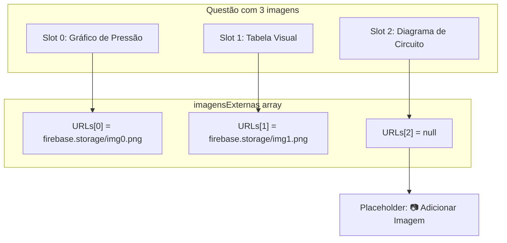
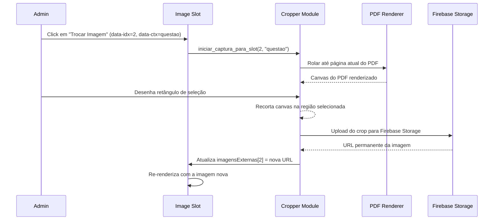

# Image Slot — Gerenciamento de Slots de Imagem

> 🤖 **Disclaimer**: Documentação gerada por IA e pode conter imprecisões. [📋 Reportar erro](https://github.com/TouchRefletz/maia.api/issues/new?title=Erro+na+doc:+image-slot&labels=docs)

## Visão Geral

O módulo **Image Slot** gerencia os "encaixes" (slots) de imagens dentro de blocos estruturados de questões. Quando o [scanner de OCR](/ocr/scanner-pipeline) detecta uma imagem no PDF, a IA gera um bloco `{ tipo: "imagem", conteudo: "descrição visual..." }`. O Image Slot é o sistema que:
1. Cria o placeholder visual no DOM para essa imagem
2. Gerencia o binding entre imagens externas (Firebase Storage URLs) e slots posicionais
3. Permite que administradores troquem/adicionem imagens via [Cropper](/cropper/visao-geral)

## Arquitetura de Slots



### Binding Posicional

O binding entre slots e URLs é **posicional**: o primeiro bloco `tipo: "imagem"` no array `estrutura` mapeia para `imagensExternas[0]`, o segundo para `imagensExternas[1]`, e assim por diante. Isso significa que a ordem dos blocos de imagem na estrutura é CRÍTICA — reordenar blocos pode desalinhar imagens.

## Estados de um Slot

| Estado | Visual | Interatividade |
|--------|--------|---------------|
| **Com URL + Readonly** | `` com zoom (click) | Cursor zoom-in |
| **Com URL + Editável** | `` + botão "🔄 Trocar" | Click no botão abre Cropper |
| **Sem URL + Editável** | Placeholder cinza "📷" | Click abre Cropper (captura nova) |
| **Sem URL + Readonly** | Texto "(Imagem não disponível)" | Nenhuma |

## Fluxo de Captura/Troca

Quando o admin clica em "🔄 Trocar Imagem" ou no placeholder:



## `data-idx` e `data-ctx`

Cada slot carrega dois data-attributes no botão de interação:
- `data-idx`: Índice posicional no array `imagensExternas` (0, 1, 2...)
- `data-ctx`: Contexto de renderização (`"questao"` para enunciado, nome da alternativa para alts)

O Cropper usa `data-ctx` para saber onde salvar a URL resultante:
- `data-ctx="questao"` → `imagensExternas[data-idx]`
- `data-ctx="A"` → `imagensAlternativaA[data-idx]`

## Alternativas com Imagens

Alternativas também podem conter slots de imagem. O binding funciona de forma análoga, mas com um array separado por letra:

```javascript
// Cada alternativa tem seu próprio array de imagens
window.iniciar_captura_para_slot_alternativa('C', 0);
// → Abre Cropper para slot 0 da alternativa C
```

## Captions (Legendas)

Se o bloco de imagem possui `conteudo` (descrição visual da IA), ele é renderizado como caption abaixo da imagem:

```html
<div class="structure-image-wrapper">
  
  <div class="structure-caption markdown-content" data-raw="Gráfico mostrando...">
    IA: Gráfico mostrando relação pressão x volume
  </div>
</div>
```

O prefixo "IA:" indica que a descrição foi gerada automaticamente.

## Referências Cruzadas

- [Structure Render — Renderiza slots como parte da estrutura](/render/structure)
- [Cropper — Ferramenta de recorte de imagem](/cropper/visao-geral)
- [Card Template — Exibe slots no modo readonly do Banco](/banco/card-template)
- [Config IA — Define blocos tipo "imagem" no schema](/embeddings/config-ia)
