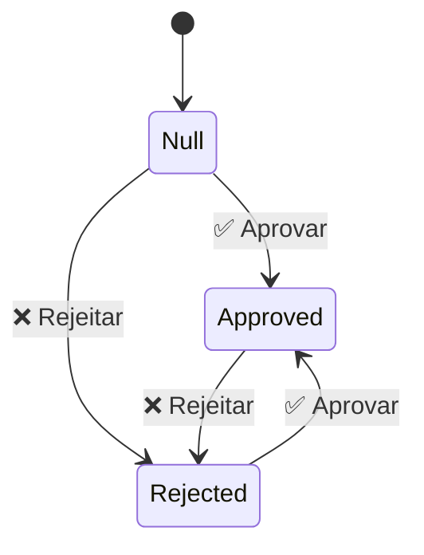

# Mobile Review — Renderização Responsiva e Revisão

> 🤖 **Disclaimer**: Documentação gerada por IA e pode conter imprecisões. [📋 Reportar erro](https://github.com/TouchRefletz/maia.api/issues/new?title=Erro+na+doc:+mobile-review&labels=docs)

## Visão Geral

O módulo `Mobile Review` abrange os componentes de interface que habilitam o **fluxo de revisão de IA e usabilidade em telas pequenas** no ecossistema de upload e visualização do maia.edu. Ele é constituído principalmente por dois núcleos no diretório `js/render/`:

1. `MobileLayout.tsx`: Implementa interações avançadas de toque (swipe, drag) para as Bottom Sheets do painel (como o menu contextual mobile).
2. `ReviewButtons.tsx`: Fornece a matriz de componentes de **Auditoria de IA** que permitem ao humano aceitar/rejeitar predições do Gemini visualmente no celular ou desktop.

Com o crescimento das equipes de upload remoto usando tablets, essas adaptações modulares permitiram que a interface legacy de desktop escalasse elegantemente sem precisar de aplicativos nativos.

## A Dinâmica de Mobile Layout (`MobileLayout.tsx`)

O `MobileLayout.tsx` injeta um ouvinte inteligente na raiz do Sidebar visualizador. Na UX mobile moderna, em vez de sidebars rígidos, usamos folhas inferiores (Bottom Sheets) que o usuário pode puxar e arrastar.

### Implementação do Touch/Swipe

O componente `MobileInteractableHeader` não retorna muito JSX; seu principal propósito é ser um Wrapper que espiona eventos nativos de toque:

```tsx
export const MobileInteractableHeader: React.FC = () => {
    // ... setup
    const handleTouchMove = (e: TouchEvent) => {
        const touch = e.touches[0];
        const deltaY = touch.clientY - startY;
        const newTranslate = currentTranslate + deltaY;
        const maxTranslate = getSheetHeight() - PEEK_HEIGHT;

        // Limita o arrasto físico usando CSS Transform translateY para 60fps constantes
        if (newTranslate >= -20 && newTranslate <= maxTranslate + 20) {
            sidebar.style.transform = `translateY(${newTranslate}px)`;
            if (Math.abs(deltaY) > 5) {
                isDragging = true;
            }
        }
    };

    const handleTouchEnd = (e: TouchEvent) => {
        // ... limpa estilo de transição manual e entrega para o CSS natural
        const deltaY = touch.clientY - startY;

        // Se o usuário aplicar força suficiente (Swipe > 60px)
        if (Math.abs(deltaY) > 60) {
            if (deltaY > 0) esconderPainel(); // Para baixo (esconde)
            else mostrarPainel();             // Para cima (abre)
        }
        // ...
    };
```

Esse ouvinte de gestos é puramente agnóstico quanto à renderização React adjacente. Manipulamos o DOM original (que é Legacy HTML) acessando os IDs `viewerSidebar` e `viewerBody`. Essa é a essência do nosso padrão "Ponte": Reatividade moderna orquestrando elementos arcaicos perfeitamente para suportar as views móveis de drag.

## Componente de Fluxo de Revisão (`ReviewButtons.tsx`)

Sempre que a IA extrai algo do scan, não salvamos sem consentimento humano no banco de dados. Os componentes centralizados do `ReviewButtons.tsx` fornecem a flexibilidade para construir rapidamente qualquer painel de Aceite/Recusa visual.

### Arquitetura de Estados de Revisão

As botoleiras de revisão aceitam estritamente um conjunto triplo de estados: `'approved' | 'rejected' | null`. 



### O Pattern `ReviewableField`

O pattern favorito da nossa taxonomia é envelopar qualquer campo texto num `ReviewableField`. Isso faz a mágica de injetar botões ao longo do `div` automaticamente:

```tsx
export const ReviewableField: React.FC<{
  fieldId: string;
  state: 'approved' | 'rejected' | null;
  onApprove: (fieldId: string) => void;
  // ...
}> = ({ fieldId, state, onApprove, onReject, children, label }) => {

  const stateClass = state === 'approved' ? 'field-approved' 
                     : state === 'rejected' ? 'field-rejected' : '';

  return (
    <div className={`reviewable-field ${stateClass}`}>
      <div className="reviewable-field-header">
        <span className="field-label">{label}</span>
        <ReviewButtons fieldId={fieldId} state={state} onApprove={onApprove} />
      </div>
      <div className="reviewable-field-content">
        {children} {/* Aqui vai o conteúdo real extraído */}
      </div>
    </div>
  );
};
```

Esses estados (`field-approved` e `field-rejected`) acionam tokens CSS em toda a aplicação que inserem glows pulsantes laranjas quando requer atenção, glows verdes quando aceito, ou texto riscado (`text-decoration: line-through; opacity: 0.5`) quando rejeitado.

### Revisão em Massa: Tags

Outro diferencial é o componente `ReviewableTags`, usado geralmente para as matérias identificadas ou palavras-chave de um gabarito. Em vez da IA empurrar 4 tags inteiras goela abaixo do revisor, cada pequena tag exibe nano-botões de revisão individuais (`review-btn--xs`). O estado de revisão passado deve ser um grande Record-dicionário: 
`Record<string, 'approved' | 'rejected' | null>`.

```tsx
export const ReviewableTags: React.FC<{
  items: string[];
  fieldPrefix: string;  // Prefixo como 'kw' => tags ficam kw_0, kw_1...
  reviewState: Record<string, 'approved' | 'rejected' | null>;
  // ...
}>
```

## Referências Cruzadas

- [UI Modais — Onde muitas Bottom Sheets são originárias](/ui/modais)
- [Scanner UI — Terminal de extração afetado pelos botões de revisão](/ui/scanner-ui)
- [Render Components — Entendimento de render de OCR original](/render/render-components)
