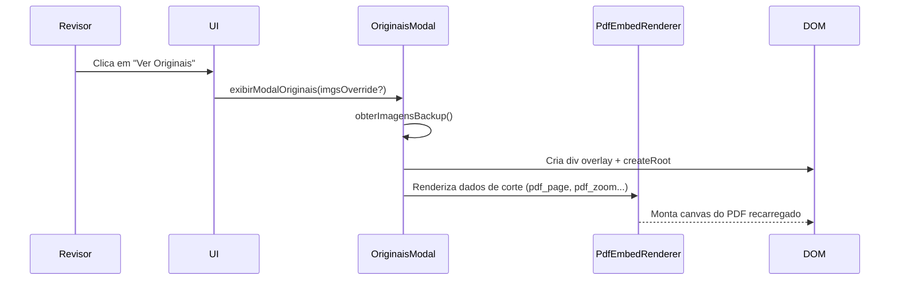

# OriginaisModal — Modal de Consulta aos Crotes Originais

> 🤖 **Disclaimer**: Documentação gerada por IA e pode conter imprecisões. [📋 Reportar erro](https://github.com/TouchRefletz/maia.api/issues/new?title=Erro+na+doc:+originais-modal&labels=docs)

## Visão Geral

O `OriginaisModal.tsx` (`js/render/final/OriginaisModal.tsx`) é um componente React montado dinamicamente que exibe as **imagens ou recortes originais** (crops) que deram origem à extração de uma questão. Durante a fase de auditoria/revisão do upload automático, o revisor humano pode invocar este modal para comparar o JSON estruturado gerado pela IA (enunciado, alternativas, gabarito) com o scan original da página de onde os dados vieram.

Com 146 linhas, o componente faz a ponte entre o antigo sistema de imagens `Base64` e o novo sistema de renderização nativa de PDFs via `PdfEmbedRenderer`.

## Fluxo de Execução



## Sistema de Backup de Imagens (`obterImagensBackup`)

Como a UI do terminal de upload é renderizada de forma assíncrona, a referência aos recortes originais de uma questão muitas vezes reside em variáveis globais. O modal usa uma cascata de fallbacks para encontrar esses dados:

```typescript
export function obterImagensBackup(): ImagensBackup {
  const questao = window.__ultimaQuestaoExtraida;

  // 1. Array de recortes PDF (novo sistema)
  if (questao?.fotos_originais?.length > 0) {
    return { imgsQ: questao.fotos_originais };
  }

  // 2. Imagem única (sistema antigo / fallback)
  if (questao?.foto_original) {
    return { imgsQ: [questao.foto_original] };
  }

  // 3. Fallbacks globais de pipeline
  const imgsQ = window.__BACKUP_IMGS_Q?.length > 0
    ? window.__BACKUP_IMGS_Q
    : window.__imagensLimpas?.questao_original || [];

  return { imgsQ };
}
```

O uso de variáveis injetadas em `window` deve-se à arquitetura do `terminal-ui.js` preexistente. O argumento `imgsOverride` permite um fluxo mais limpo (passagem de props) quando o chamador possui os dados locais.

## Renderização Flexível de Imagens

O sub-componente `ListaImagens` itera sobre as fontes de imagem e suporta **dois modos distintos de renderização** baseados no tipo de dado:

### Modo 1: Imagens Base64 ou URLs (Legado)

Se o array contém strings puras, elas são renderizadas como tags `` tradicionais.

```tsx
if (typeof item === 'string') {
   if (item === 'filled') return; // Ignora placeholders sem source
   return ;
}
```

### Modo 2: Mapeamento Dinâmico de PDF (Novo)

O núcleo de inovação do sistema OCR do maia.edu é não salvar imagens estáticas, mas sim **coordenadas de recorte** de um PDF. O modal importa `<PdfEmbedRenderer />` e o alimenta com as coordenadas originais:

```tsx
if (typeof item === 'object' && item !== null) {
  return (
    <PdfEmbedRenderer
        pdfUrl={item.pdf_url}
        pdf_page={item.pdf_page}
        pdf_zoom={item.pdf_zoom}
        pdf_left={item.pdf_left}
        pdf_top={item.pdf_top}
        pdf_width={item.pdf_width}
        pdf_height={item.pdf_height}
        // Metadata do crop real
        pdfjs_source_w={item.pdfjs_source_w}
        pdfjs_source_h={item.pdfjs_source_h}
        pdfjs_x={item.pdfjs_x}
        pdfjs_y={item.pdfjs_y}
        pdfjs_crop_w={item.pdfjs_crop_w}
        pdfjs_crop_h={item.pdfjs_crop_h}
        scaleToFit={true}
        readOnly={true}
    />
  );
}
```

Isso garante uma qualidade vetorial absurda caso o revisor queira inspecionar a fórmula química ou matemática, pois o modal re-renderiza o PDF original diretamente em vez de usar uma imagem comprimida Jpeg.

## Design e Montagem Dinâmica no DOM

O modelo não é renderizado na árvore principal do React (o que dependeria de estado global no painel). Em vez disso, `exibirModalOriginais()` instaura uma nova árvore React diretamente no nível do Body:

```typescript
export function exibirModalOriginais(imgsOverride?: any[]): void {
  if (document.querySelector('.img-overlay')) return; // Previne duplicatas

  const overlay = document.createElement('div');
  overlay.className = 'img-overlay';
  document.body.appendChild(overlay);

  const finalImgs = imgsOverride ?? obterImagensBackup().imgsQ;
  const root = createRoot(overlay);

  const handleClose = () => {
    root.unmount(); // Limpeza de memória do React
    overlay.remove(); // Limpeza do DOM
  };

  root.render(<ModalOriginais onClose={handleClose} imgsQ={finalImgs} />);
}
```

Isso torna o modal totalmente agnóstico; ele pode ser disparado de scripts TypeScript ou de handlers `onclick` de HTML Legacy gerado de forma imperativa, funcionando como uma ponte unificadora entre as pilhas tecnológicas.

## Referências Cruzadas

- [PdfEmbedRenderer — O motor de renderização PDF via Canvas](/ui/pdf-renderers)
- [Scanner UI — Onde o PDF original reside](/ui/scanner-ui)
- [Terminal UI — Onde o botão "Ver Original" normalmente reside](/upload/terminal-ui)
- [Cropper — Ferramenta que gerou as coordenadas usadas nesta preview](/cropper/visao-geral)
