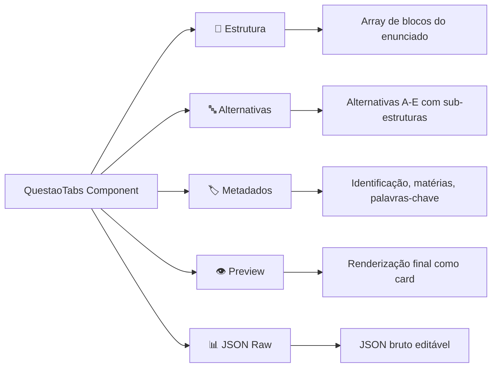

# QuestaoTabs — Interface de Abas para Questões

> 🤖 **Disclaimer**: Documentação gerada por IA e pode conter imprecisões. [📋 Reportar erro](https://github.com/TouchRefletz/maia.api/issues/new?title=Erro+na+doc:+questao-tabs&labels=docs)

## Visão Geral

O `QuestaoTabs.tsx` (`js/render/QuestaoTabs.tsx`) é o **segundo maior componente** do módulo render, com 41.158 bytes. Ele implementa a interface de **abas navegáveis** para visualização e edição de questões de vestibular no fluxo de upload. Enquanto o [GabaritoCard](/render/gabarito) renderiza apenas o gabarito, o QuestaoTabs renderiza a **questão inteira** dividida em tabs: Estrutura, Alternativas, Metadados, e Preview.

## Anatomia das Tabs



## Tab: Estrutura

Exibe o array de blocos do enunciado em formato editável. Cada bloco é um "card" arrastável com:
- **Tipo selector**: Dropdown para alterar o tipo (texto → equação, etc.)
- **Editor inline**: Textarea para editar o conteúdo
- **Controles**: Mover para cima/baixo, deletar, duplicar
- **Preview**: Renderização em tempo real do bloco

```tsx
{questao.estrutura?.map((bloco, i) => (
  <BlocoEditor
    key={i}
    bloco={bloco}
    index={i}
    onChange={(updated) => updateBloco(i, updated)}
    onDelete={() => deleteBloco(i)}
    onMove={(dir) => moveBloco(i, dir)}
  />
))}
<button onClick={addBloco}>+ Adicionar Bloco</button>
```

## Tab: Alternativas

Exibe as alternativas A-E com seus respectivos sub-estruturas. Cada alternativa pode ser editada individualmente:

- **Letra**: Fixa (A, B, C, D, E) ou editável para formatos não-padrão
- **Estrutura interna**: Array de blocos (texto, equação, imagem) editáveis
- **Toggle**: Marcar como "tem estrutura" ou "texto simples"

Para questões dissertativas (`tipo_resposta === "dissertativa"`), esta tab exibe um aviso e campos alternativos para a resposta modelo e critérios de correção.

## Tab: Metadados

Formulário com campos:
- **Identificação**: Ex: "ENEM 2023 - Q45" (text input)
- **Matérias Possíveis**: Multiselect com tags (chips adicionáveis/removíveis)
- **Palavras-Chave**: Tags editáveis
- **Tipo de Resposta**: Radio: objetiva / dissertativa

## Tab: Preview

Renderiza a questão como ficaria no Banco de Questões, usando o [Card Template](/banco/card-template). Permite validar visualmente antes de salvar no Firebase.

## Tab: JSON Raw

Exibe o JSON bruto da questão num editor de código com syntax highlighting. Permite edição direta para power users que preferem mexer no JSON.

## State Management

O componente usa `useState` com objeto complexo e handlers de atualização parcial:

```typescript
const [questao, setQuestao] = useState(initialData.dados_questao);
const [gabarito, setGabarito] = useState(initialData.dados_gabarito);
const [activeTab, setActiveTab] = useState(0);
const [unsavedChanges, setUnsavedChanges] = useState(false);

const updateBloco = (index: number, updated: BlocoConteudo) => {
  setQuestao(prev => ({
    ...prev,
    estrutura: prev.estrutura.map((b, i) => i === index ? updated : b)
  }));
  setUnsavedChanges(true);
};
```

## Persistência

Alterações são auto-salvas com debounce de 2 segundos:

```typescript
useEffect(() => {
  if (!unsavedChanges) return;
  const timer = setTimeout(() => {
    onSave({ dados_questao: questao, dados_gabarito: gabarito });
    setUnsavedChanges(false);
  }, 2000);
  return () => clearTimeout(timer);
}, [questao, gabarito, unsavedChanges]);
```

Isso garante que nenhuma edição é perdida mesmo se o admin fechar a aba acidentalmente.

## Wrapper Legacy em `questao-tabs.js`

O arquivo `js/render/questao-tabs.js` (3.755 bytes) é o adapter que monta o componente React no DOM via `createRoot`:

```javascript
import { createRoot } from "react-dom/client";
import { QuestaoTabs } from "./QuestaoTabs.tsx";

export function montarQuestaoTabs(container, data, onSave) {
  const root = createRoot(container);
  root.render(<QuestaoTabs data={data} onSave={onSave} />);
  return root;
}
```

## Referências Cruzadas

- [GabaritoCard — Renderiza o gabarito dentro de uma das tabs](/render/gabarito)
- [Structure Render — Renderiza os blocos na tab de preview](/render/structure)
- [Card Template — Usado na tab de preview](/banco/card-template)
- [Config IA — Define os tipos de bloco e schema de questão](/embeddings/config-ia)
