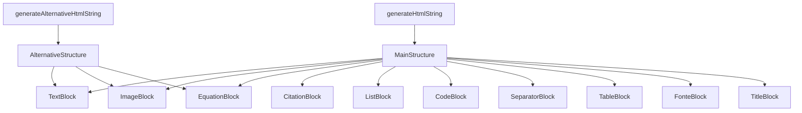

# Render Components — Componentes React de Renderização

> 🤖 **Disclaimer**: Documentação gerada por IA e pode conter imprecisões. [📋 Reportar erro](https://github.com/TouchRefletz/maia.api/issues/new?title=Erro+na+doc:+render-components&labels=docs)

## Visão Geral

O `StructureRender.tsx` (`js/render/StructureRender.tsx`) é o módulo central de componentes React que renderiza blocos de conteúdo estruturado de questões de vestibular. Com 28.127 bytes, é a contraparte React do `structure.js` legado — exportando dois geradores de HTML estático (`generateHtmlString` e `generateAlternativeHtmlString`) que produzem markup a partir de arrays de blocos tipados.

## Arquitetura de Componentes



## `generateHtmlString` — O Ponto de Entrada

Esta função é chamada por `structure.js` como bridge. Internamente usa `ReactDOMServer.renderToStaticMarkup()`:

```typescript
export function generateHtmlString(
  estrutura: BlocoConteudo[],
  imagensExternas: string[],
  contexto: string,
  isReadOnly: boolean
): string {
  const element = (
    <MainStructure
      estrutura={estrutura}
      imagensExternas={imagensExternas}
      contexto={contexto}
      isReadOnly={isReadOnly}
    />
  );
  return ReactDOMServer.renderToStaticMarkup(element);
}
```

O `renderToStaticMarkup` gera HTML puro sem atributos React internos (`data-reactid`, etc.), ideal para inserção via `innerHTML`.

## Componentes de Bloco

### TextBlock
Renderiza texto Markdown com suporte a LaTeX inline. O conteúdo é escapado e armazenado em `data-raw` para hydration posterior:

```tsx
const TextBlock = ({ conteudo, className }: Props) => (
  <div className={`structure-block ${className} markdown-content`}
       data-raw={escapeAttr(conteudo)}>
    {conteudo}
  </div>
);
```

### ImageBlock
Renderiza imagens com lógica condicional complexa:
- **URL existe + readonly**: `` clicável com zoom
- **URL existe + editável**: `` + botão "🔄 Trocar Imagem"
- **URL ausente + editável**: Placeholder "📷 Adicionar Imagem"
- **URL ausente + readonly**: "(Imagem não disponível)"

### EquationBlock
Renderiza equações LaTeX em display mode (`\\[...\\]`):
```tsx
const EquationBlock = ({ conteudo }: Props) => (
  <div className="structure-block structure-equacao">
    {`\\[${conteudo}\\]`}
  </div>
);
```

### TableBlock
Renderiza tabelas Markdown. O conteúdo é armazenado em `data-raw` e convertido para HTML pela hydration via biblioteca de Markdown-to-HTML.

### CodeBlock
Envolve o conteúdo em `<pre><code>` para preservar formatação e monospace.

### SeparatorBlock
Simples `<hr>` horizontal sem conteúdo.

### FonteBlock
Bloco de créditos/referência em itálico small, tipicamente "Fonte: IBGE, 2023".

## Alternativas: Renderização Específica

O `generateAlternativeHtmlString` lida com a estrutura interna de alternativas de múltipla escolha. Alternativas podem conter blocos complexos (texto + equação + imagem), não apenas texto puro:

```typescript
export function generateAlternativeHtmlString(
  estrutura: BlocoConteudo[],
  letra: string,
  imagensExternas: string[],
  contexto: string
): string {
  // No contexto "banco", alternativas são sempre readonly
  const isReadOnly = contexto === "banco";
  const element = (
    <AlternativeStructure
      estrutura={estrutura}
      letra={letra}
      imagensExternas={imagensExternas}
      isReadOnly={isReadOnly}
    />
  );
  return ReactDOMServer.renderToStaticMarkup(element);
}
```

## Tipagem TypeScript

```typescript
interface BlocoConteudo {
  tipo: 'texto' | 'imagem' | 'citacao' | 'titulo' | 'subtitulo' |
        'lista' | 'equacao' | 'codigo' | 'destaque' | 'separador' |
        'fonte' | 'tabela';
  conteudo: string;
  imagem_url?: string;
  url?: string;
}
```

A tipagem garante que blocos inválidos são detectados em compile-time, reduzindo bugs de runtime.

## Sanitização XSS

Todo conteúdo inserido em atributos HTML é escapado via função `escapeAttr()`:

```typescript
function escapeAttr(str: string): string {
  return str
    .replace(/&/g, '&amp;')
    .replace(/"/g, '&quot;')
    .replace(/</g, '&lt;')
    .replace(/>/g, '&gt;');
}
```

Isso previne ataques XSS quando conteúdo de questões (que vem de OCR/IA) é injetado no DOM.

## Performance

`renderToStaticMarkup` é significativamente mais rápido que `renderToString` porque não inclui atributos de hydration React. Para 10 blocos de estrutura, o render leva < 1ms — imperceptível para o usuário.

## Referências Cruzadas

- [Structure.js — Adapter legado que chama este módulo](/render/structure)
- [Card Template — Invoca renderização de questões inteiras](/banco/card-template)
- [Config IA — Define os tipos de bloco válidos](/embeddings/config-ia)
- [Hydration — Ativa LaTeX e Markdown após render](/render/hydration)
