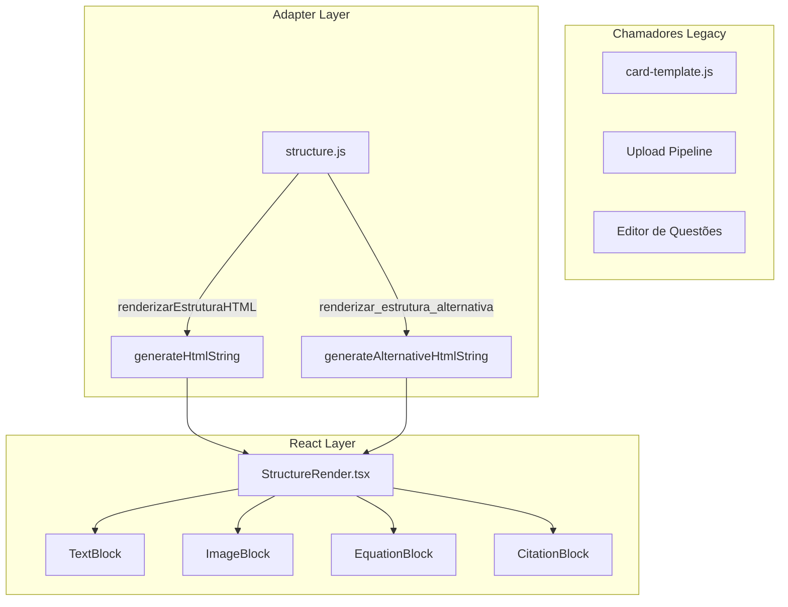

# Structure Render — Renderização Estruturada de Questões

> 🤖 **Disclaimer**: Documentação gerada por IA e pode conter imprecisões. [📋 Reportar erro](https://github.com/TouchRefletz/maia.api/issues/new?title=Erro+na+doc:+structure&labels=docs)

## Visão Geral

O módulo `structure.js` (`js/render/structure.js`) é o **adaptador central de renderização** que transforma arrays de blocos tipados (texto, equação, imagem, citação, etc.) em HTML estático renderizável no DOM. É o ponto de convergência entre o JSON estruturado produzido pelo [scanner de questões](/ocr/scanner-pipeline) e as interfaces visuais do Banco de Questões e do editor de upload.

Com 205 linhas, este módulo opera como um **Adapter Pattern**: ele expõe funções legadas de renderização que internamente delegam ao componente React `StructureRender.tsx`, mantendo compatibilidade com código antigo enquanto migra gradualmente para o ecossistema React.

## Arquitetura de Ponte (JS Legacy ↔ React)



O código antigo chama `renderizarEstruturaHTML(estrutura, imgs, contexto)`. Internamente, isso invoca `generateHtmlString` do `StructureRender.tsx`, que usa `ReactDOMServer.renderToStaticMarkup()` para produzir HTML estático a partir de componentes React tipados.

## Funções Exportadas

### `renderizarEstruturaHTML(estrutura, imagensExternas, contexto, isReadOnly)`

Função orquestradora principal. Recebe um array de blocos e retorna uma string HTML completa:

```javascript
export function renderizarEstruturaHTML(estrutura, imagensExternas = [], contexto = "questao", isReadOnly = false) {
  return generateHtmlString(estrutura, imagensExternas, contexto, isReadOnly);
}
```

**Parâmetros:**
| Parâmetro | Tipo | Descrição |
|-----------|------|-----------|
| `estrutura` | `BlocoConteudo[]` | Array de blocos tipados da questão |
| `imagensExternas` | `string[]` | URLs de imagens do Firebase Storage |
| `contexto` | `string` | `"questao"` ou `"banco"` — controla se botões de edição aparecem |
| `isReadOnly` | `boolean` | Se `true`, desabilita interatividade (modo banco) |

### `renderizar_estrutura_alternativa(estrutura, letra, imagensExternas, contexto)`

Renderiza a estrutura interna de uma alternativa (A, B, C...). Alternativas podem conter múltiplos blocos (texto + equação + imagem), não apenas texto puro:

```javascript
export function renderizar_estrutura_alternativa(estrutura, letra, imagensExternas = [], contexto = "questao") {
  return generateAlternativeHtmlString(estrutura, letra, imagensExternas, contexto);
}
```

### `renderizarBlocoTexto(tipo, conteudoRaw, conteudoSafe)` (Legacy)

Função mantida **apenas por compatibilidade**. Gera HTML para blocos de texto individuais via switch/case. O fluxo principal já não a utiliza — o React cuida disso internamente.

```javascript
switch (tipo) {
  case "texto":    return criarMarkdown("structure-text");
  case "citacao":  return criarMarkdown("structure-citacao");
  case "destaque": return criarMarkdown("structure-destaque");
  case "titulo":   return criarMarkdown("structure-titulo");
  case "equacao":  return `<div class="structure-equacao">\\[${conteudoRaw}\\]</div>`;
  case "codigo":   return `<pre class="structure-codigo"><code>${conteudoRaw}</code></pre>`;
  case "separador": return `<hr class="structure-separador" />`;
}
```

### `renderizarBlocoImagem(bloco, imgIndex, ...)` (Legacy)

Renderiza slots de imagem com lógica condicional:
- **Se `src` existe + `isReadOnly`**: Imagem clicável com zoom (`window.expandirImagem`)
- **Se `src` existe + editável**: Imagem + botão "🔄 Trocar Imagem" para re-crop
- **Se `src` ausente + editável**: Placeholder "📷 Adicionar Imagem Aqui" com trigger de captura
- **Se `src` ausente + readOnly**: Texto cinza "(Imagem não disponível)"

### `normalizarBlocoEstrutura(bloco)` / `normalizarEstrutura(array)`

Funções de sanitização que validam e normalizam blocos antes da renderização:

```javascript
export function normalizarBlocoEstrutura(bloco) {
  const rawTipo = bloco?.tipo ?? "imagem";
  let tipo = String(rawTipo).toLowerCase().trim();

  if (!TIPOS_ESTRUTURA_VALIDOS.has(tipo)) {
    tipo = "imagem"; // Fallback: tipo desconhecido → trata como imagem
  }

  let conteudo = String(bloco?.conteudo ?? "");
  if (tipo === "separador") conteudo = conteudo.trim();

  return { tipo, conteudo };
}
```

A constante `TIPOS_ESTRUTURA_VALIDOS` é importada de `main.js` e define o set de tipos permitidos. Qualquer tipo não reconhecido é degradado para `"imagem"` como fallback seguro.

## Os 12 Tipos de Bloco

| Tipo | Classe CSS | Renderização | Exemplo |
|------|-----------|-------------|---------|
| `texto` | `structure-text` | Markdown com `data-raw` para hydration | Parágrafos do enunciado |
| `citacao` | `structure-citacao` | Blockquote estilizado | "Segundo Darwin..." |
| `destaque` | `structure-destaque` | Callout com borda colorida | "ATENÇÃO: Use g=10" |
| `titulo` | `structure-titulo` | H3 interno (NÃO identificação da questão) | "Texto I" |
| `subtitulo` | `structure-subtitulo` | H4 interno | "Fragmento" |
| `fonte` | `structure-fonte` | Texto small em itálico | "Fonte: IBGE, 2023" |
| `lista` | `structure-lista` | Markdown list | "- Item 1\n- Item 2" |
| `equacao` | `structure-equacao` | LaTeX display mode `\\[...\\]` | `\int_0^1 x^2 dx` |
| `codigo` | `structure-codigo` | `<pre><code>` | Código fonte |
| `separador` | `structure-separador` | `<hr>` horizontal | Divisor visual |
| `imagem` | `structure-image-wrapper` | `` com zoom/crop | Figuras do enunciado |
| `tabela` | `structure-tabela` | Markdown table → HTML | Dados tabulares |

## Hydration via `data-raw`

Blocos de texto são renderizados com o atributo `data-raw` contendo o Markdown/LaTeX original escapado:

```html
<div class="structure-block structure-text markdown-content"
     data-raw="A massa de $H_2O$ é...">
  A massa de $H_2O$ é...
</div>
```

O [módulo de hydration](/render/hydration) posteriormente varre todos os `.markdown-content[data-raw]`, decodifica o Markdown, renderiza LaTeX via KaTeX, e substitui o conteúdo. Isso desacopla a geração HTML (rápida, server-renderable) da renderização rica (assíncrona, depende de libs externas).

## Contexto de Uso: Questão vs. Banco

O parâmetro `contexto` controla se elementos editáveis aparecem:

| Contexto | Botão "Trocar Imagem" | Placeholder "Adicionar" | Tooltip de edição |
|----------|----------------------|------------------------|-------------------|
| `"questao"` (editor) | ✅ Visível | ✅ Visível | ✅ Ativo |
| `"banco"` (readonly) | ❌ Oculto | ❌ Oculto | ❌ Desativado |

No Banco de Questões, os cards são readonly — o aluno não pode editar a estrutura. No editor de upload, o admin pode trocar imagens e reorganizar blocos.

## Referências Cruzadas

- [StructureRender.tsx — Implementação React dos componentes de bloco](/render/render-components)
- [Card Template — Principal consumidor desta função](/banco/card-template)
- [Hydration — Renderização de Markdown/LaTeX pós-mount](/render/hydration)
- [Config IA — Define os tipos de bloco válidos](/embeddings/config-ia)
