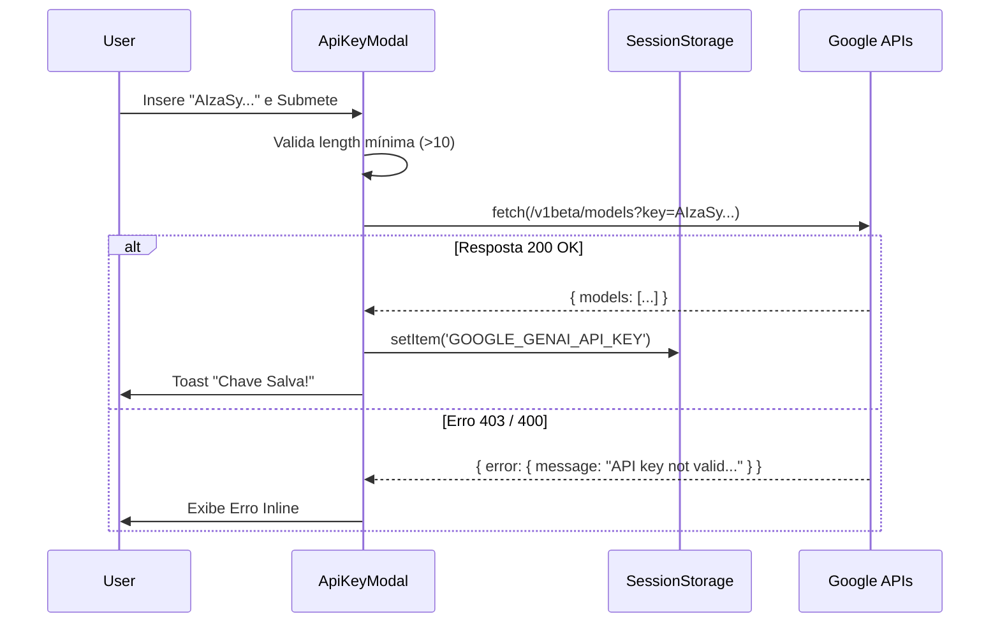

# API Key Modal — Gerenciamento de Credenciais GenAI

> 🤖 **Disclaimer**: Documentação gerada por IA e pode conter imprecisões. [📋 Reportar erro](https://github.com/TouchRefletz/maia.api/issues/new?title=Erro+na+doc:+api-key-modal&labels=docs)

## Visão Geral

O componente `ApiKeyModal.tsx` (`js/ui/ApiKeyModal.tsx`) gerencia a configuração **Client-Side** (BYOK - Bring Your Own Key) para a API do Google Gemini. Em vez de rotear todas as chamadas de inferência por um proxy backend do Maia (que poderia gargalar a cota e aumentar latência), o ecossistema permite que usuários power-users e administradores insiram suas próprias chaves do Google AI Studio para usufruir de **Performance Máxima (Rate Limits Isolados)**.

Com 271 linhas, o componente abstrai o fluxo de validação real da chave inserida, persistência local e intercâmbio de estados de fallback (Chave Própria vs. Chave Padrão).

## Fluxo de Autenticação e Validação

Quando o usuário insere uma chave, não aceitamos cegamente. Antes de salvar, fazemos uma requisição de Teste (Ping) ao endpoint de listagem de modelos do Gemini para confirmar se a permissão e assinatura são verídicas.



### O Ping de Teste (`testarChaveReal`)

O teste é assíncrono e isolado. Se a key for inválida, barramos na hora:

```typescript
export async function testarChaveReal(key: string): Promise<{ valido: boolean; msg?: string }> {
  try {
    const response = await fetch(
      `https://generativelanguage.googleapis.com/v1beta/models?key=${key}`,
      { method: 'GET' }
    );
    if (response.ok) return { valido: true };
    const err = await response.json();
    return { valido: false, msg: err.error?.message || 'Erro na API.' };
  } catch (e) {
    return { valido: false, msg: 'Erro de conexão.' };
  }
}
```

## Persistência de Tokens (Segurança)

A chave é armazenada EXCLUSIVAMENTE em `sessionStorage` (e, em algumas integrações, `localStorage` para sessões duradouras). Não trafegamos esta credencial para os bancos de dados principais (`Firestore`). 

O componente obriga o usuário a ler e aceitar um termo de responsabilidade no formulário checkbox:
> "Li e compreendo os riscos de armazenar minha chave no navegador (Client-Side). Assumo a responsabilidade pela segurança da minha credencial."

Se a chave estiver configurada, todas as chamadas futuras ao motor OCR e ao [Extraction Service](/api-worker/extraction) priorizam esse token lido de `sessionStorage`.

## Alternância de Estados UI

A interface adapta inteligentemente a renderização baseada na existência da chave:

- **Se não há chave**: Exibe um layout de duas colunas, a esquerda com input de "Cole sua API Key aqui" acompanhado por Termos de Risco. A direita lista benefícios (Privacidade, Sem Limites, Controle Total).
- **Se a chave já foi salva**: Retira o formulário confuso e exibe um simples Card de Confirmação verde "✅ Chave Própria Ativa", mudando o Action principal para "Remover minha chave (Voltar ao Padrão)".

```tsx
 {isCustomKey ? (
    <>
      <div style={{ background: 'var(--color-success-bg)' }}>...</div>
      <button onClick={handleRemove}>Remover minha chave</button>
    </>
 ) : (
    <form onSubmit={handleSubmit}>
      {/* Inputs... */}
    </form>
 )}
```

## Método de Montagem Isolada via Root (`mountApiKeyModal`)

Assim como o [Originais Modal](/render/originais-modal), este componente não habita inicialmente o DOM. Uma função exportada cria e anexa a raiz React (`createRoot`) por fora do React Tree, o que possibilita que arquivos legados `js/` chamem-o sem refatorações sistêmicas pesadas.

```typescript
export function mountApiKeyModal(forceShow: boolean = true) {
  const rootId = 'react-api-key-modal-root';
  // Configs e Root Mounting...
  root.render(<ApiKeyModalComponent onClose={handleClose} />);
}
```

## Referências Cruzadas

- [Extraction Worker — Onde a chave é lida e usada](/api-worker/extraction)
- [Modais UI Base — Arquitetura de design dos modais](/ui/modais)
- [Originais Modal — Outro componente root isolado](/render/originais-modal)
