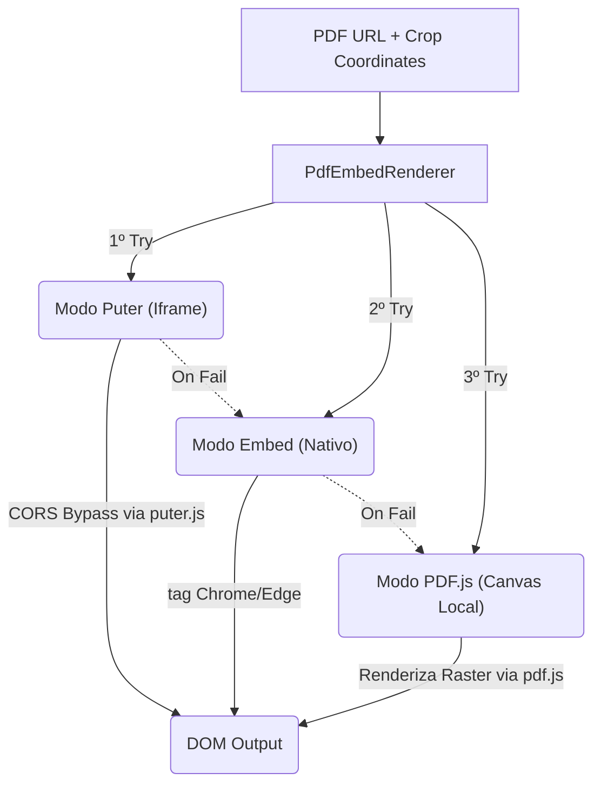

# PDF Renderers — Motores de Visualização Híbrida

> 🤖 **Disclaimer**: Documentação gerada por IA e pode conter imprecisões. [📋 Reportar erro](https://github.com/TouchRefletz/maia.api/issues/new?title=Erro+na+doc:+pdf-renderers&labels=docs)

## Visão Geral

O submódulo `pdf-renderers` compreende componentes React avançados que encapsulam a exibição de conteúdos PDF com foco primordial na visualização isolada de "Crops" (recortes). Devido às estritas políticas de CORS e segurança do navegador ao carregar URLs cruzadas de storage buckets (ex: Supabase, Firebase) e gerar frames vetoriais, a renderização de fatias de PDF exigia um mecanismo tolerante a falhas.

O componente-chefia da arquitetura é o `PdfEmbedRenderer.tsx` (`js/ui/PdfEmbedRenderer.tsx` - >1400 linhas), que implementa o padrão de **Toggle Render Mode** (Modo de Renderização Alternável), possuindo três abordagens de renderização fallback unidas num único componente plug-and-play.

## Padrão Arquitetural de 3 Camadas (Fallback Triplo)

O componente mantém o estado `<'puter' | 'embed' | 'pdfjs'>`, permitindo alternância forçada (pelo usuário via botão da interface) ou automática caso o limite do browser/memória falhe numa das vias.



### 1. Modo Puter (Padrão)
Renderiza um `<iframe src="/pdf-viewer.html?url=...">` apontando para nossa página de bypass externa. A página `pdf-viewer.html` foi isolada porque ela invoca a biblioteca global `puter.js` que engole perfeitamente os problemas de Strict CORS e passa a exibir a prova em um visualizador PDF.js embutido de altíssimo nível.

### 2. Modo Embed (Alta Fidelidade)
Aproveita a implementação nativa de C++ dos navegadores (Chromium/Edge) através da tag `<embed src="...#toolbar=0&navpanes=0&view=FitH,top">`. Gera vetores perfeitos de fontes complexas e Latex. 
A limitação deste modo é que `<embed>` não admite bypass de CORS nativamente se o servidor remoto não consentir, e ele descarta sumariamente parâmetros `view=Fit` em alguns updates da engine Chrome.

### 3. Modo PDF.js (Canvas Local e Uploads Manuais)
Carrega a engine da Mozilla via `window.pdfjsLib` locamente na thread principal. Ele transcreve a página do PDF pixel-a-pixel via `canvas.getContext('2d')`.
**Diferencial**: Se a fonte não é uma URL, mas um `File` Blob (porque caiu em política de segurança total e exigimos um upload mecânico local), apenas a Mode 3 funciona.

## Algoritmo de Translação de Coordenadas (Crop)

Um diferencial do maia.edu é não armazenar JPGs fatiados, mas a página original indexada + coordenadas matriciais de corte. O renderer efetua CROP matemático:

```typescript
// Exemplo em Modo PDF.JS (Canvas Local)
const scale = sourceW / unscaledViewport.width;
const viewport = pdfPage.getViewport({ scale });

canvas.width = cropW;
canvas.height = cropH;

// Preenche fundo branco anti-transparências
context.fillStyle = '#FFFFFF';
context.fillRect(0, 0, finalWidth, finalHeight);

context.save();
context.translate(-cropX, -cropY); // Desloca para encostar apenas o miolo do recorte

const renderTask = pdfPage.render({ canvasContext: context, viewport });
```

No modo nativo ou Puter, a string Query Param ou Fragment (`#zoom=...`) é parametrizada calculando a relação de `Zoom Dinâmico = LarguraRecorte / AlturaPágina * 130%`.

## Concorrência de Render e UX 

Componentes React reagem agressivamente a mudançãs de parent DOMs causando Multi-Renders. O RenderPDF blinda essa tempestade implementando locks (`isRenderingRef.current`):

```typescript
if (isRenderingRef.current) {
  console.log("Render já em andamento, ignorando chamada duplicada");
  return;
}
```

O componente também calcula o ScaleDinâmico observando o `ResizeObserver` no Elemento Pai para evitar que recortes matematicamente gigantescos excedessem 80% da Altura Visual Útil (80vh), garantindo responsividade mobile por padrão sem CSS Media Queries mirabolantes.

## Referências Cruzadas

- [Scanner UI — Terminal pai que acopla e injeta estes players PDF](/ui/scanner-ui)
- [Image Slot — Card renderizado pelo Banco que consome essa Engine](/render/image-slot)
- [Originais Modal — Inspeciona arquivos nativamente englobando PdfEmbedRenderer](/render/originais-modal)
