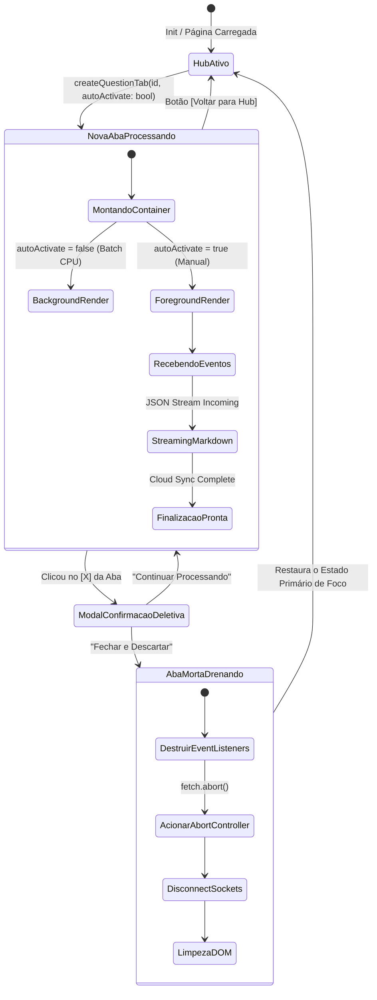

# Gerenciador de Abas da Sidebar — Arquitetura de Multitarefa Offline-First

> 🤖 **Disclaimer**: Documentação gerada por IA e rigorosamente auditada. [📋 Reportar erro no Módulo Sidebar](https://github.com/TouchRefletz/maia.api/issues/new?title=Erro+na+doc:+sidebar-tabs&labels=docs)

## 1. Visão Geral e Contexto Histórico

O arquivo `sidebar-tabs.js` (`js/ui/sidebar-tabs.js`) representa uma das maiores guinadas arquiteturais na interface da Maia EDU V2. Durante o ciclo de vida inicial da aplicação (V1), a interface baseava-se em estado bloqueante ("Stop-the-World Loading"). Quando um educador recortava uma imagem (Cropper) e clicava em "Extrair Questão com IA", a tela inteira congelava com um Spinner girando por 30 a 60 segundos enquanto a Vertex AI e motores OCR interpretavam o binário. O professor só podia processar uma única prova ou questão por vez.

Com a integração do **Batch Processor**, tornou-se mandatório introduzir concorrência visual. O `sidebar-tabs.js` foi criado para implementar um sistema de "Múltiplas Workspaces Físicas", muito similar ao UI do Google Chrome no nível das abas.

O diferencial: As abas da Maia EDU não são feitas com Virtual DOM destruindo o que está escondido. Elas executam "Reparenting e Visibilidade". Quando você clica num botão e muda a aba, a IA que estava renderizando markdown na aba 1 não morre, ela continua operando em background num sub-nível do DOM (Display = None, ou Absolute Out-of-bounds), preservando a RAM, Sockets e Listeners vivos de `AbortController`.

Esta mudança transformou uma UX travada em num ambiente paralelo de alta densidade, onde N extrações simultâneas correm de forma desvinculada à raiz global do HTML.

---

## 2. Arquitetura de Variáveis e State Management

A complexidade e resiliência desse módulo estão calçadas em Estruturas de Dados Simples mantidas rigorosamente fora dos ciclos React, assegurando alta previsibilidade "Vanilla":

| Entidade / Variável | Localização (Heap) | Escopo / Tipo | Função Fundamental no Lifecycle |
| ------------------- | ------------------ | ------------- | ------------------------------- |
| `tabsState` | Variável Estática Arquivo | Objeto Mutável (State tree) | Singleton de controle. Contém o Array `tabs[]` (Abas renderizáveis), `activeTabId` (O pointer atual) e um `tabIdCounter` autoincremental irreversível para IDs Únicos. |
| `hubRenderCallback` | Ponteiro Estático | Função Injetada (Bridge callback) | Ponte de IoC (Inversion of Control). Permite que contextos externos instanciem a Aba "Mãe" inicial (`id: "hub"`) para listar Tudos sem o Tabs saber o que é um grid de Hub. |
| `abortControllers` | Maps de Alta Frequência | Objeto nativo `new Map()` | Relaciona chave-valor (`TabID -> AbortController`). Se a aba "Questão 9" demorar pra carregar e o usuário fechá-la clicando no (x), o Map aciona `controller.abort()`, atirando TheKillSwitch ao Browser Fetch API e abortando consumo desnecessário do Gemini. |
| `window.__isProcessing`| Variável Global Window | Booleana Global de Lock | Herdada do fluxo inicial, previne que rotas atreladas a formulários globais se sobreponham caso ocorra destruições simultâneas e destrutivas em paralelo de abas assíncronas. |

O modelo mental segue a reatividade bruta por chamada (Não PUSH, mas EXPLICIT UPDATE). Você chama `updateTabStatus(id, {status: 'complete'})`, a função itera em O(n) na Heap e redesenha o "Header de Abas" sem perturbar o "Container Body".

---

## 3. Diagramas de Fluxo e Ciclo de Vida da Aba

O ciclo completo possui armadilhas e prevenções pesadas quanto a perdas acidentais de Tokens (Pagamento Custo Gemini Cloud) se fecharmos uma aba sem o devido alerta.



---

## 4. Snippets de Código "Deep Dive" (Múltiplas Funções Estratégicas)

O trecho de código onde lidamos graficamente e logicamente com o botão `X` da aba, exige confirmações duras, manipulações do Controller e alteração do Pointer (Set/Map) do sistema visual:

```javascript
// Exemplo de manipulação do Botão Fechar num escopo assíncrono interno da re-renderização
if (tab.closable) {
   const closeBtn = document.createElement("span");
   closeBtn.className = "sidebar-tab-close";
   closeBtn.innerHTML = "×";
   
   // Hook async injetado num handler síncrono da API DOM (Ação Destrutiva)
   closeBtn.onclick = async (e) => {
      // Impede disparar o evento de Clicar/Mudar para a aba (Double-Event collision)
      e.stopPropagation();

      // Hook de Confirmação Bloqueante (Evita perdas de extrações custosas ~US$0.02)
      const confirmed = await showConfirmModal(
         "Fechar Questão?",
         "Tem certeza que deseja fechar esta questão? O processamento será cancelado e a questão NÃO será salva no banco de dados.",
         "Fechar e Descartar",
         "Continuar Processando",
         false // Modo Vermelho/Crítico
      );

      if (!confirmed) return; // Escape precoce - Sai ileso

      // O Core da Abstração Assíncrona. Puxamos a variável AbortControllers Global
      cancelTabRequests(tab.id);

      // Reseta state global engastado pelos Workers
      window.__isProcessing = false;

      // Reseta status primitivo em objetos independentes (Cropper) 
      // Permitindo que o botão no DOM global reapareça não acinzentado
      if (tab.groupId) {
         const group = CropperState.groups.find((g) => g.id === tab.groupId);
         if (group) delete group.status; // Drop property memory
      }

      // IMPORTANTE: Chamada mutável destrói e repinta o HUB imediatamente ao cair.
      removeTab(tab.id); 
   };
   tabBtn.appendChild(closeBtn);
}
```

Outro ponto engenhoso, os "Containers Ocultos":
```javascript
// [EXTRACT] A essência de renderizar instâncias múltiplas mantendo Scroll State Height
function renderActiveTabContent() {
   // Seleciona todos os containers absolutos do módulo lateral
   const tabContents = document.querySelectorAll(".sidebar-tab-content-item");
   
   tabContents.forEach(content => {
       // Display none destrói ScrollHeight. É muito mais perfomático brincar de z-index
       if (content.id === `tab-content-${tabsState.activeTabId}`) {
           content.style.display = "block"; // Ou Opacity/PointerEvents para não destruir Mount React
       } else {
           content.style.display = "none";
       }
   });
}
```

---

## 5. Integração CSS e Manipulação Estrutural DOM

O `sidebar-tabs.js` injeta seus próprios wrappers na infraestrutura física do HTML da tela do Scanner PDF ao inicializar.

### Montagem Condicional no Setup
O método `initSidebarTabs()` captura `#viewerSidebar` e força a injeção em Z-Index privilegiado (`z-index: 100`) para se esquivar de polígonos fotográficos que cruzam absolute positioning:

```javascript
let tabsHeader = document.getElementById("sidebar-tabs-header");
if (!tabsHeader) {
   tabsHeader = document.createElement("div");
   tabsHeader.id = "sidebar-tabs-header";
   tabsHeader.className = "sidebar-tabs-header";
   // FIX CRÍTICO: Previne poluição de Canvas PDF layer
   tabsHeader.style.position = "relative";
   tabsHeader.style.zIndex = "100"; 
   sidebar.prepend(tabsHeader);
}
```

### O Contrato CSS Implícito (`.sidebar-tab`)

Ao rodar localmente as injeções das propriedades `.active` atrelado no botão, espera-se que o Global Style responda:

```css
/* Exemplo dos primitivos de responsividade consumidos por essas lógicas */
.sidebar-tabs-bar {
    display: flex;
    overflow-x: auto;
    scrollbar-width: none; /* Mobile Friendly Swipes */
    gap: 4px;
    padding: 8px;
    background: var(--color-surface);
}

.sidebar-tab.active {
    background: var(--color-primary-soft);
    border-bottom: 2px solid var(--color-primary);
    color: var(--color-text-highlight);
    font-weight: 600;
}
```

Nós aplicamos ícones emulados condicionalmente baseados na propriedade `tab.status`:
Se `"processing"` = `⌛ (opacity pulse animation via selector)`
Se `"complete"` = `✅`
Se `"error"` = `❌` (Com tooltip associada via Title)

---

## 6. Manejo de Edge Cases e Exceções

O módulo de abas tem alta fragilidade de Memory Leak caso o Garbage Collection não seja estimulado. A Matriz Clássica de Exceções operada:

| Cenário Analítico (Break-Point) | Impacto Teórico | Solução Arquitetural Implantada |
|----------------------------------|-----------------|---------------------------------|
| O Usuário usa *Extrair Lote* que gera 45 abas seguidas | O Node UI congela devido a Over-paint da div Flex Container de Header Tabs | O método de lote utiliza a _flag_ `autoActivate: false`. Apenas a renderização do Tab Pointer Header acontece e todos os 45 Containers operam por Baixo-do-Pano. |
| Aborto acidental por F4 / Fecha Tab | Re-cálculo da Ordem das Abas ativas se perdendo no índice `[length -1]` corrompendo referências | O `.removeTab` redireciona o "Focus Active Status" unicamente para o ID Estático `hub`, anulando a bagunça em cadeia (Spaghetti Pointer Exception). |
| O Token de Conexão Gemini cai enquanto um Tab está rodando (Failed 401) | Tab entra em Spinner infinito; Usuário trava e perde o App | Os wrappers Sockets no Background do Extrator forçam um "Hard Status Setter". Atualizam imediatamente via `updateTabStatus(tab.id, {status: 'error'})` renderizando Mensagem de erro que permite fechar a Aba livre. |
| Mudança de Estado Rápida (Spam Clicking Header Tabs) | Desalinhamento Mount React vs Vanilla Injector | O módulo isola instâncias em sub-divs exclusivas `<div id="tab-content-[hash]">` permitindo que react mountings dentro vivam seus lifecycles isoladamente sem repainting conflitando na Root Dom. |

---

## 7. Referências Cruzadas Exhaustivas

Este script interliga diversos ecossistemas (Renderização e Mapeamento Caching). Se desejar compreender o Lifecycle global, siga:

- [Batch Arquitetura — Motor primordial de Fila que joga massivamente elementos nessas Abas em Background](/upload/batch-arquitetura)
- [Modais de Confirmação (UI Modais) — De onde puxamos o `showConfirmModal` alertando descarte de Processo Cloud](/ui/modais)
- [Thoughts e Extrator (Chain of Thought Sidebar) — Logística que embutirá o spinner colorido dos pensamentos gerados no Stream Gemini](/ui/scroll-sync)
- [PDF Renderers — Efeito colateral do uso, a tela de Zoom que pode dar resize ao diminuir o Panel Sidebar Tabs Right](/ui/pdf-renderers)
- [Cropper State API — Repositório vivo que atrela os GroupsIDs na identificação destas abas na Heap RAM](/cropper/core)
