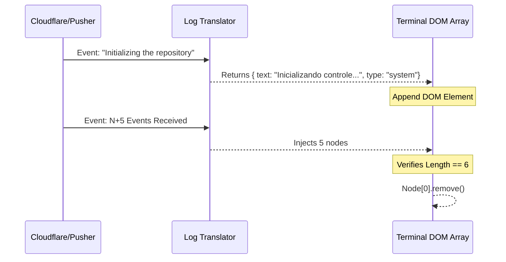

# Terminal UI — Engine Gráfica de Retrocomputação e Loading

> 🤖 **Disclaimer**: Documentação gerada por IA e pode conter imprecisões. [📋 Reportar erro](https://github.com/TouchRefletz/maia.api/issues/new?title=Erro+na+doc:+terminal-ui&labels=docs)

## Visão Geral

O arquivo `terminal-ui.js` (`js/upload/terminal-ui.js`) transcende um mero gerador de divs HTML; trata-se de um complexo motor de renderização construído inteiramente em Javascript Modular Escalonável (VainillaJS). Com mais de 1.300 linhas de código, este utilitário é responsável por traduzir o comportamento de IAs Generativas — tradicionalmente obscuro para o usuário comum — numa experiência visual de Console Retrô, altamente tangível e tranquilizadora. Ele provê à Maia.edu uma camada de feedback contínuo enquanto "OpenHands" (GitHub Actions) ou Processadores RAG são executados em Nuvem, os quais podem demorar dezenas de minutos sem que a aplicação cliente morra em silêncio.

## 1. Topologia de Inicialização e Parâmetros

A instanciação do TerminalUI é altamente flexível, suportando tanto Seletores de String (`#id`) quanto Elementos Nativos injetados dinamicamente. Esta abordagem desacopla o componente de frameworks complexos, tornando-o facilmente atrelável tanto no Form Logic primário quanto num Workflow Sidebar secundário.

### Padrão de Chamada
```javascript
import { TerminalUI } from "./terminal-ui.js";

const consoleContainer = document.createElement("div");
consoleContainer.id = "deep-search-terminal";
document.body.appendChild(consoleContainer);

const terminalInstance = new TerminalUI(consoleContainer, {
    maxLogs: 5,           // Controle do Garbage Collector
    vibration: true,      // Taptic Feedback em Mobile API
    floatMode: false      // Acoplamento DOM vs CSS Fixed
});
```

A classe encapsula suas dependências isoladamente: ela não confia em estilos externos acidentais. Um processo de injeção massiva de CSS é disparado se (e somente se) não encontrar uma tag `<style id="terminal-styles">` prévia na Tree.

## 2. A Malha de Estados (`this.MODES`)

Para modelar o progresso visual de forma fluída e linear, o terminal define uma máquina de estados (State Machine) unificada:

| Modo (State) | Range Esperado | Narrativa Visual | Comportamento Relacional |
|--------------|----------------|------------------|--------------------------|
| `BOOT` | 0% - 10% | Acionando Containers | O terminal trava e pulsa em Laranja. Reflete a fase em que o Docker / EC2 está ligando os recursos alocados pelo Worker. |
| `EXEC` | 10% - 90% | Computação em Rota | Foca puramente no LogTranslator. O Painel principal assume tom azul escuro para evitar stress ocular e scroll infinito. Extrema latência esperada. |
| `VERIFY` | 90% - 99% | Salvamento & Commits | Estado Limbo focado em garantir que, embora a Cloudflare tenha recebido o PDF base, os Embeddings realmente entraram no Vector DB (Pinecone). |
| `DONE` | 100% | Renderização Categórica | Cor verde sólida (`var(--color-success)`); dispara transições e remove event listeners ociosos. Revela botões dinâmicos de prosseguimento (Ver Prova, etc.) |

---

## 3. Arquitetura da Barra de Progresso (P-Controller)

O maior desafio em UI/UX para loadings que não operam via Stream de binários, mas via *Eventos Discretos Imprevisíveis*, é o "salto" numérico brusco. O terminal contorna a imprevisibilidade usando lógica de Proportional Controller (Controller-P) extraída diretamente da engenharia de controle clássica, injetando animação baseada em `requestAnimationFrame`.

```javascript
tick(deltaTime) {
   // Se estamos na fase EXEC (IA rodando), a barra "arrasta" devagar
   // baseada na predição de tempo estipulada em 180 segundos.
   if (this.state === this.MODES.EXEC) {
       this.progress += (this.targetProgress - this.progress) * 0.05 * (deltaTime / 16);
   }

   // Nunca estourar além do máximo antes do evento determinístico "DONE"
   if (this.progress > 95 && this.state !== this.MODES.DONE) {
       this.progress = 95; // Falsa Lentidão
   }
       
   this.renderProgressBar();
}
```

A barra parece sempre ter "fôlego" visual contínuo, mesmo que não caiam conexões do Websocket. Há uma interrupção súbita no P-Controller caso ocorra perda de sinal, onde a barra pisca vermelho num pulso (Red Shift) acusando lentidão de processamento cloud.

---

## 4. O Sistema Chain of Thought (Mapeamento de Logs)

Diferente do CLI padrão (Console de Desenvolvedor) em que o código engole tudo e preenche o log usando overflow hidden ou scrolling sujo, a Maia constrói visualmente o "Chain of Thought" da I.A através das invocações encapsuladas:
```javascript
terminalInstance.processLogLine(mensageCrua);
```

### 4.1 O Filtro Hermenêutico (`LogTranslator`)
Antes de printar, a classe atira a string num funil de Intercepção. Esse funil transforma o ruído técnico numa estrutura limpa:
1. `type: "in_progress"`: Gera um spinner CSS rotatório nativo simulando processamento (Uma mini lupa buscando coisas).
2. `type: "system"`: Emprega cores de Console Ubuntu clássicas (Monospace limpo sem spinner).
3. `type: "success"`: Engatilha o ícone de Checkmark verde ao lado esquerdo do Thought Node.

### 4.2 O Módulo Garbage Collector
Para evitar estrangulamento da CPU local em sessões que excedem os limites, o DOM dos Logs sofre descarte premonitório. O "Self-Healing Stream" foi calibrado para `maxLogs = 5` estritamente.


Seis blocos colapsariam o estilete gráfico. O Node `.remove()` assegura fluidez absoluta (High FPS CSS Painting) nas janelas dos professores, rodando nativamente a constantes 60 Quatros por Segundo.

---

## 5. Integração Flutuante (Window Reparenting)

Comportamento crucial em sistemas dinâmicos como o "Banco de Questões", o terminal incorpora métodos `setFloatMode(boolean)`.
Em certas circunstâncias do *Maia EDU*, os uploads ou Extrações (OCR) começam numa tela (ex: Form Logic View) e o professor voluntariamente desvia navegando para a "Home page" da aplicação (via React Router / Single Page Events).

Ao perceber o evento de que a janela-mãe sairá do Lifecycle local, o `TerminalUI` detecta a requisição e migra do DOM da tela de carregamento atrelando em si próprio a métrica absoluta CSS:

```css
.terminal-float {
   position: fixed;
   bottom: 20px;
   right: 20px;
   width: 320px;
   height: auto;
   z-index: 99999;
   border-radius: 12px;
   box-shadow: 0 10px 40px rgba(0,0,0,0.8);
   transition: transform 0.3s cubic-bezier(0.1, 1, 0.4, 1);
}
```
Através do Lifecycle Reparenting `document.body.appendChild(terminal)`, o Terminal se desprende e acompanha o Usuário em qualquer rotação da SPA, nunca o impedindo de interagir ou editar formulários paralelos enquanto aquele monstro multi-nodal devora uma prova FUVEST 50 Páginas no background.

---

## 6. Edge Cases: O Modal de Retry de IA (Anti-Catástrofe)

Inteligências Artificiais e Scraping massivo (`OpenHands`) tendem a desalinhar dependendo dos ventos cibernéticos (Erro 503 na AWS, Bugs de RegEx).
Quando o Socket recebe falha letal `Process Timeout`, o Terminal não se fecha destruindo a janela. Ele transita ao modo vermelho Carmesim agressivo, removendo o Logging central e acendendo um CTA gigantesco: **Tentar Novamente**.

O callback `terminal.onRetry = (mode) => {}` devolve o comando ao Orquestrador (ex: `Search Logic`) sem descartar o contexto original do `currentSlug` gerado pela API no tempo `t=0`, preservando tudo e impedindo faturas duplicadas à Conta da Digital Ocean alheia.

---

## Referências Cruzadas de Arquitetura

Como componente de front-end, essa UI não processa HTTP local, atuando mais como uma casca inteligente manipulada a laser por scripts maiores:

- [Search Logic — Módulo que invoca este Terminal, atrela WebSocket Pushers e controla seu Flutuador](/upload/search-logic)
- [Log Translator — O Motor Léxico em que esta classe mergulha seus strings sujos no intuito de receber limpos](/upload/log-translator)
- [Terminal Chain — Abstração textual do CSS encarregada do Grid lateral dentro deste terminal](/upload/terminal-chain)
- [Banco de Questões — Repositório vivo renderizado sob o Terminal ao fundo quando finalizado.](/render/estrutura)
